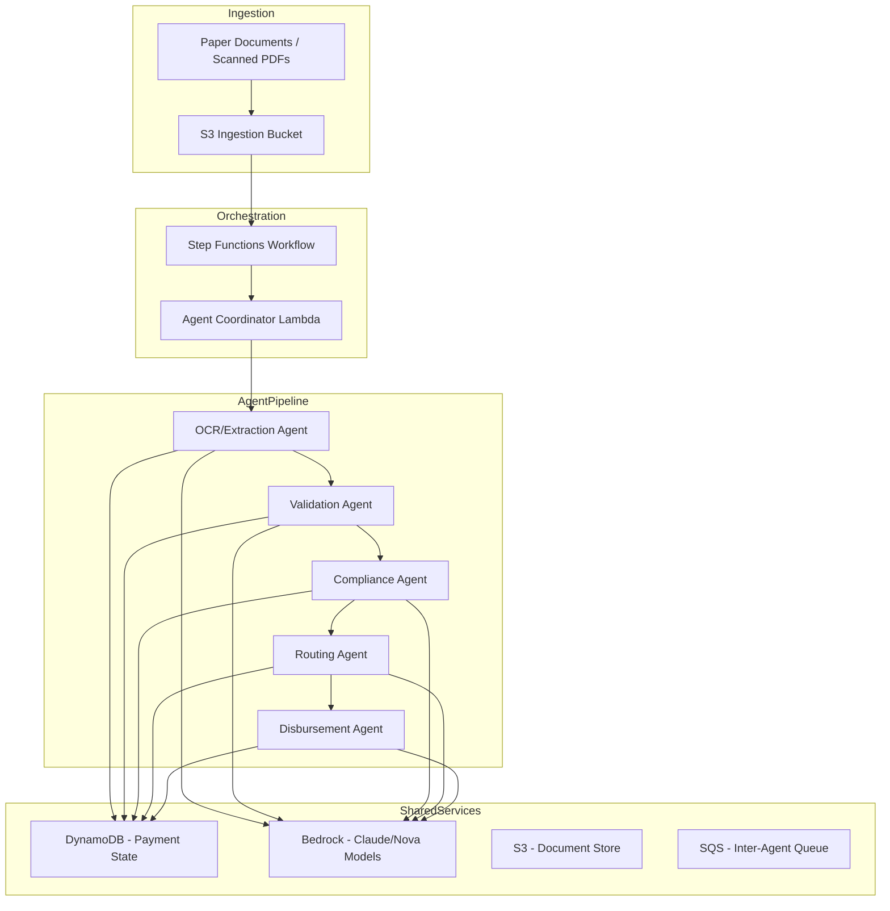
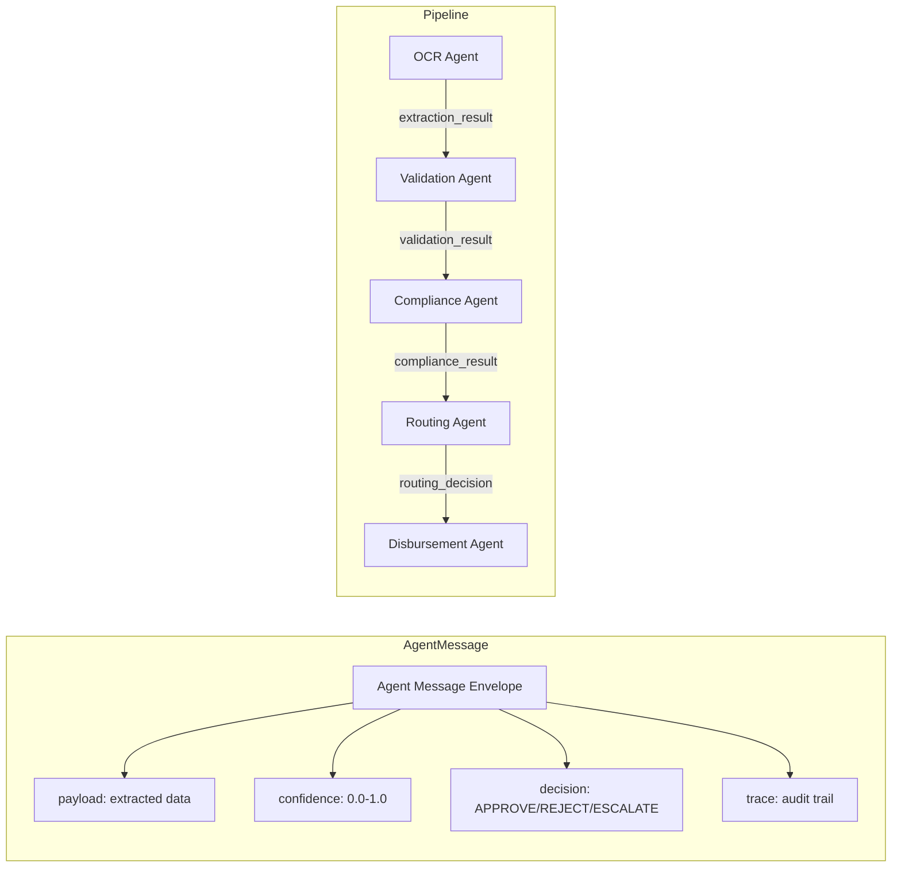
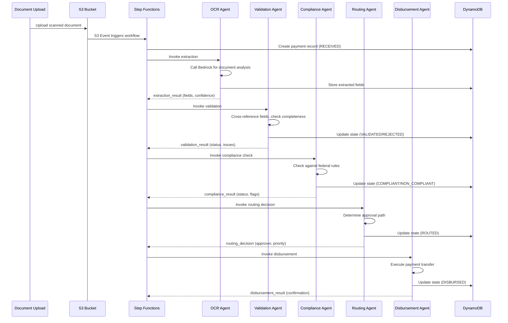
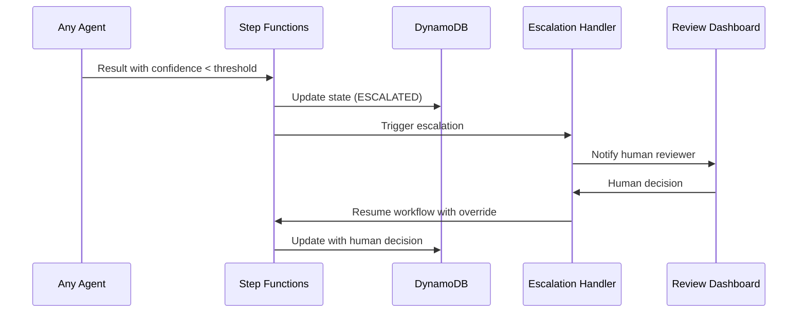
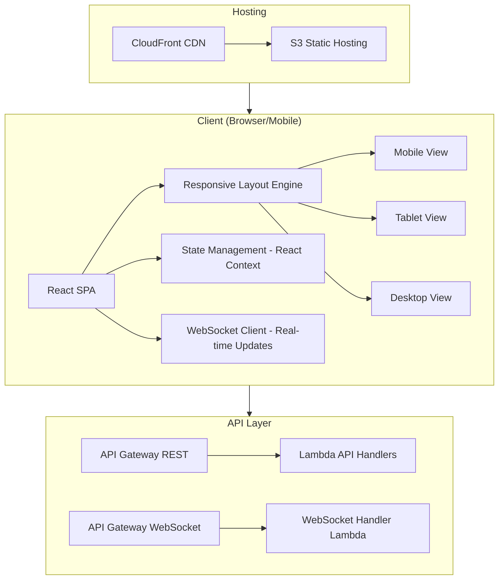
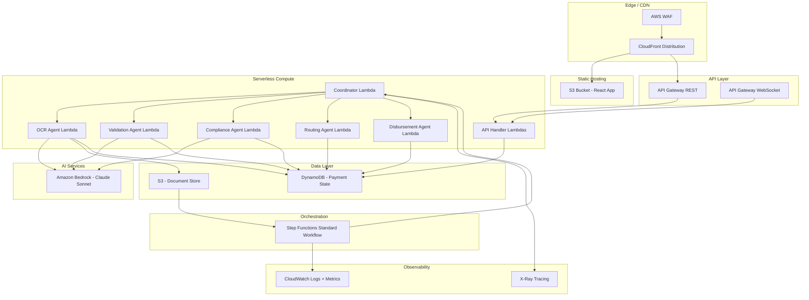
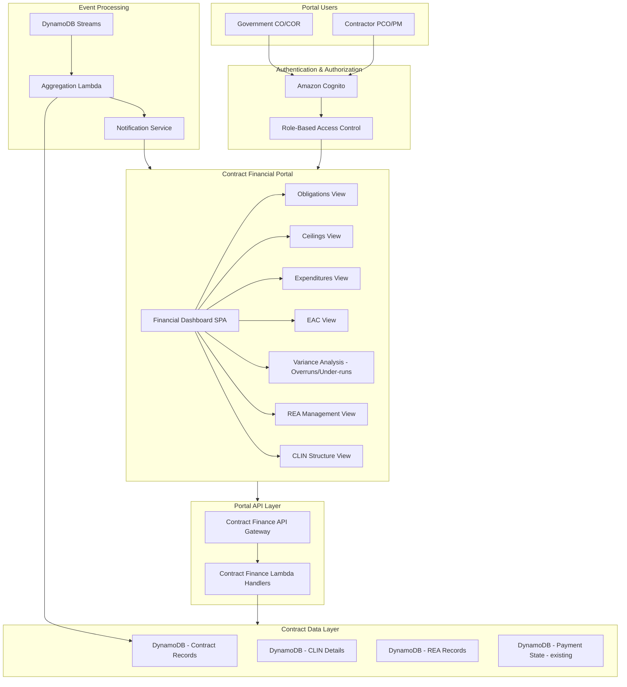
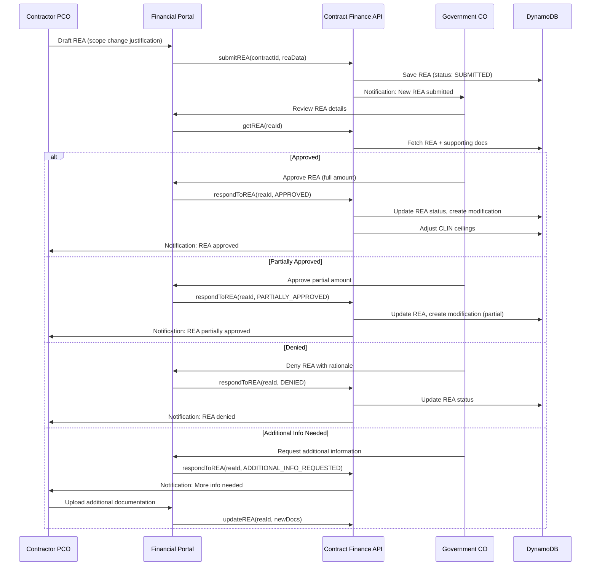
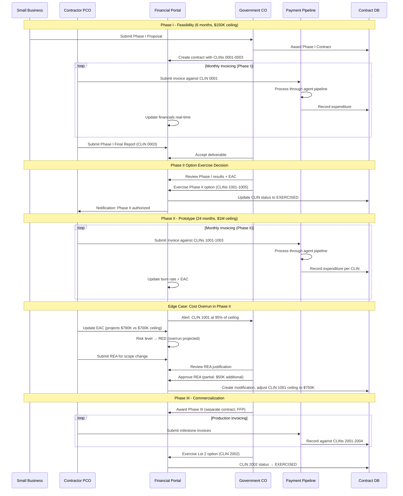

# Design Document: Federal Payment Processing — Agentic AI Platform

## Overview

This platform automates end-to-end federal payment processing using a coordinated multi-agent AI architecture deployed on AWS. Aligned with the March 2025 Executive Order to eliminate paper-based payments, the system orchestrates five specialized AI agents — Document Processing, Validation, Compliance, Routing, and Disbursement — that communicate through a shared event pipeline to transform paper documentation into validated electronic payments.

The architecture follows a ChatDev-inspired approach where agents prompt each other through structured message passing, with AWS Step Functions orchestrating the workflow and Amazon Bedrock providing the foundational AI capabilities. Each agent operates autonomously within its domain while contributing to a deterministic, auditable payment pipeline. The system is designed as a hackathon demonstrator using synthetic data, proving the viability of multi-agent coordination for government payment modernization.

## Architecture

### System-Level Architecture



### Agent Communication Architecture



## Sequence Diagrams

### Main Payment Processing Flow



### Error Handling & Escalation Flow



## Components and Interfaces

### Component 1: Agent Coordinator (Step Functions + Lambda)

**Purpose**: Orchestrates the multi-agent pipeline, manages state transitions, handles retries and escalations.

```pascal
INTERFACE AgentCoordinator
  startWorkflow(documentId: UUID, source: S3Path): WorkflowExecution
  getWorkflowStatus(executionId: UUID): WorkflowState
  escalateToHuman(paymentId: UUID, reason: String): EscalationTicket
  resumeAfterEscalation(paymentId: UUID, decision: HumanDecision): WorkflowExecution
END INTERFACE
```

**Responsibilities**:
- Trigger each agent in sequence based on previous agent output
- Track overall workflow state in DynamoDB
- Handle timeout and retry logic for each agent step
- Route to escalation when confidence thresholds are not met

### Component 2: OCR/Extraction Agent

**Purpose**: Processes incoming scanned documents using Amazon Bedrock multimodal capabilities to extract structured payment data.

```pascal
INTERFACE ExtractionAgent
  extractDocument(documentPath: S3Path): ExtractionResult
  classifyDocument(documentPath: S3Path): DocumentType
  getConfidence(result: ExtractionResult): Float
END INTERFACE
```

**Responsibilities**:
- Classify incoming document type (invoice, purchase order, travel voucher)
- Extract key fields: payee, amount, account numbers, dates, line items
- Return confidence scores for each extracted field
- Handle multi-page documents and poor scan quality

### Component 3: Validation Agent

**Purpose**: Cross-references extracted data against known records and validates completeness, correctness, and internal consistency.

```pascal
INTERFACE ValidationAgent
  validatePayment(extraction: ExtractionResult): ValidationResult
  checkCompleteness(fields: FieldSet): CompletenessReport
  crossReference(payee: PayeeInfo, database: PayeeRegistry): MatchResult
END INTERFACE
```

**Responsibilities**:
- Verify all required fields are present and well-formed
- Cross-reference payee information against registered vendor database
- Check for duplicate payments (same payee, amount, date)
- Validate mathematical consistency (line items sum to total)

### Component 4: Compliance Agent

**Purpose**: Evaluates payments against federal regulations, agency policies, and spending thresholds using Bedrock for rule interpretation.

```pascal
INTERFACE ComplianceAgent
  checkCompliance(payment: ValidatedPayment): ComplianceResult
  evaluateThresholds(amount: Decimal, category: SpendCategory): ThresholdCheck
  checkBlacklist(payee: PayeeInfo): BlacklistResult
  auditTrail(paymentId: UUID): AuditRecord
END INTERFACE
```

**Responsibilities**:
- Check payment against FAR (Federal Acquisition Regulation) rules
- Verify spending thresholds and approval authority levels
- Screen payees against OFAC sanctions and debarment lists
- Generate compliance audit trail for each decision

### Component 5: Routing Agent

**Purpose**: Determines appropriate approval authority based on payment amount, type, and agency hierarchy.

```pascal
INTERFACE RoutingAgent
  determineRoute(payment: CompliantPayment): RoutingDecision
  getApprovalAuthority(amount: Decimal, type: PaymentType): Approver
  checkDelegation(approver: Approver, date: Date): DelegationStatus
END INTERFACE
```

**Responsibilities**:
- Map payment amount to required approval level
- Handle delegation of authority when primary approver unavailable
- Route urgent payments through expedited paths
- Log routing rationale for audit purposes

### Component 6: Disbursement Agent

**Purpose**: Executes the final electronic payment after all approvals, generating confirmation and updating treasury records.

```pascal
INTERFACE DisbursementAgent
  executeDisbursement(approved: ApprovedPayment): DisbursementResult
  generateConfirmation(result: DisbursementResult): PaymentConfirmation
  rollback(paymentId: UUID, reason: String): RollbackResult
END INTERFACE
```

**Responsibilities**:
- Execute electronic funds transfer via simulated treasury interface
- Generate payment confirmation with unique transaction ID
- Support rollback for failed or cancelled payments
- Produce disbursement report for reconciliation

## Data Models

### Payment Record

```pascal
STRUCTURE PaymentRecord
  paymentId: UUID
  status: PaymentStatus
  documentPath: S3Path
  extractedData: ExtractionResult
  validationResult: ValidationResult
  complianceResult: ComplianceResult
  routingDecision: RoutingDecision
  disbursementResult: DisbursementResult
  createdAt: Timestamp
  updatedAt: Timestamp
  auditTrail: List OF AuditEntry
END STRUCTURE

ENUMERATION PaymentStatus
  RECEIVED
  EXTRACTING
  EXTRACTED
  VALIDATING
  VALIDATED
  CHECKING_COMPLIANCE
  COMPLIANT
  ROUTING
  ROUTED
  APPROVING
  APPROVED
  DISBURSING
  DISBURSED
  REJECTED
  ESCALATED
  FAILED
END ENUMERATION
```

**Validation Rules**:
- paymentId must be unique across all records
- status transitions must follow defined state machine
- extractedData required before status can advance past EXTRACTED
- auditTrail must contain entry for every status transition

### Extraction Result

```pascal
STRUCTURE ExtractionResult
  documentType: DocumentType
  fields: Map OF (FieldName -> ExtractedField)
  overallConfidence: Float  // 0.0 to 1.0
  rawText: String
  processingTimeMs: Integer
END STRUCTURE

STRUCTURE ExtractedField
  value: String
  confidence: Float  // 0.0 to 1.0
  boundingBox: BoundingBox  // location in document
  normalized: String  // cleaned/formatted value
END STRUCTURE

ENUMERATION DocumentType
  INVOICE
  PURCHASE_ORDER
  TRAVEL_VOUCHER
  GRANT_PAYMENT
  CONTRACT_PAYMENT
  UNKNOWN
END ENUMERATION
```

**Validation Rules**:
- overallConfidence must be between 0.0 and 1.0
- Required fields vary by documentType
- INVOICE requires: payee, amount, invoiceNumber, date
- PURCHASE_ORDER requires: vendor, items, totalAmount, poNumber
- TRAVEL_VOUCHER requires: traveler, dates, expenses, totalClaim

### Agent Message Envelope

```pascal
STRUCTURE AgentMessage
  messageId: UUID
  sourceAgent: AgentIdentifier
  targetAgent: AgentIdentifier
  paymentId: UUID
  messageType: MessageType
  payload: JSON
  confidence: Float
  decision: Decision
  timestamp: Timestamp
  traceContext: TraceContext
END STRUCTURE

ENUMERATION Decision
  APPROVE
  REJECT
  ESCALATE
  NEEDS_INFO
END ENUMERATION

STRUCTURE TraceContext
  workflowId: UUID
  stepNumber: Integer
  parentMessageId: UUID
  agentChain: List OF AgentIdentifier
END STRUCTURE
```

## Algorithmic Pseudocode

### Main Orchestration Algorithm

```pascal
ALGORITHM orchestratePaymentWorkflow(documentEvent)
INPUT: documentEvent containing S3 bucket and key for uploaded document
OUTPUT: Final PaymentRecord with DISBURSED or REJECTED status

BEGIN
  // Step 1: Initialize payment record
  paymentId ← generateUUID()
  record ← createPaymentRecord(paymentId, documentEvent.s3Path)
  saveToDatabase(record, status: RECEIVED)

  // Step 2: Document Extraction
  extractionResult ← invokeAgent("extraction", documentEvent.s3Path)
  
  IF extractionResult.overallConfidence < EXTRACTION_THRESHOLD THEN
    escalateToHuman(paymentId, "Low extraction confidence")
    RETURN getPaymentRecord(paymentId)
  END IF
  
  updateRecord(paymentId, extractedData: extractionResult, status: EXTRACTED)

  // Step 3: Validation
  validationResult ← invokeAgent("validation", extractionResult)
  
  IF validationResult.status = REJECTED THEN
    updateRecord(paymentId, validationResult: validationResult, status: REJECTED)
    RETURN getPaymentRecord(paymentId)
  END IF
  
  IF validationResult.status = NEEDS_REVIEW THEN
    escalateToHuman(paymentId, validationResult.issues)
    RETURN getPaymentRecord(paymentId)
  END IF
  
  updateRecord(paymentId, validationResult: validationResult, status: VALIDATED)

  // Step 4: Compliance Check
  complianceResult ← invokeAgent("compliance", extractionResult, validationResult)
  
  IF complianceResult.status = NON_COMPLIANT THEN
    updateRecord(paymentId, complianceResult: complianceResult, status: REJECTED)
    RETURN getPaymentRecord(paymentId)
  END IF
  
  updateRecord(paymentId, complianceResult: complianceResult, status: COMPLIANT)

  // Step 5: Routing
  routingDecision ← invokeAgent("routing", extractionResult, complianceResult)
  updateRecord(paymentId, routingDecision: routingDecision, status: ROUTED)

  // Step 6: Approval (simulated for hackathon)
  approvalResult ← simulateApproval(routingDecision)
  updateRecord(paymentId, status: APPROVED)

  // Step 7: Disbursement
  disbursementResult ← invokeAgent("disbursement", record)
  updateRecord(paymentId, disbursementResult: disbursementResult, status: DISBURSED)

  RETURN getPaymentRecord(paymentId)
END
```

**Preconditions:**
- documentEvent contains valid S3 path to an uploaded document
- All agent Lambda functions are deployed and accessible
- DynamoDB table exists and is writable
- Bedrock model access is configured

**Postconditions:**
- PaymentRecord exists in database with terminal status (DISBURSED, REJECTED, or ESCALATED)
- Audit trail contains entry for every state transition
- All intermediate results are persisted

**Loop Invariants:** N/A (sequential pipeline, no loops)

### Document Extraction Algorithm

```pascal
ALGORITHM extractDocument(documentPath)
INPUT: documentPath (S3 path to scanned document)
OUTPUT: ExtractionResult with structured fields and confidence scores

BEGIN
  // Step 1: Retrieve document from S3
  documentBytes ← s3.getObject(documentPath)
  
  // Step 2: Classify document type using Bedrock
  classificationPrompt ← buildClassificationPrompt(documentBytes)
  classificationResponse ← bedrock.invoke(classificationPrompt, model: "claude-sonnet")
  documentType ← parseDocumentType(classificationResponse)
  
  // Step 3: Extract fields based on document type
  extractionPrompt ← buildExtractionPrompt(documentBytes, documentType)
  extractionResponse ← bedrock.invoke(extractionPrompt, model: "claude-sonnet")
  rawFields ← parseExtractionResponse(extractionResponse)
  
  // Step 4: Normalize and validate extracted values
  normalizedFields ← Map.empty()
  overallConfidence ← 1.0
  
  FOR EACH field IN rawFields DO
    normalized ← normalizeField(field.name, field.value, documentType)
    confidence ← calculateFieldConfidence(field, normalized)
    normalizedFields.put(field.name, ExtractedField(
      value: field.value,
      confidence: confidence,
      boundingBox: field.location,
      normalized: normalized
    ))
    overallConfidence ← MIN(overallConfidence, confidence)
  END FOR
  
  // Step 5: Check required fields for document type
  requiredFields ← getRequiredFields(documentType)
  FOR EACH required IN requiredFields DO
    IF NOT normalizedFields.containsKey(required) THEN
      normalizedFields.put(required, ExtractedField(
        value: "",
        confidence: 0.0,
        boundingBox: NULL,
        normalized: ""
      ))
      overallConfidence ← 0.0
    END IF
  END FOR
  
  RETURN ExtractionResult(
    documentType: documentType,
    fields: normalizedFields,
    overallConfidence: overallConfidence,
    rawText: extractionResponse.rawText,
    processingTimeMs: elapsedTime()
  )
END
```

**Preconditions:**
- documentPath points to a valid, readable object in S3
- Bedrock model access is available
- Document is a supported format (PDF, PNG, JPEG, TIFF)

**Postconditions:**
- Result contains documentType classification
- All required fields for the document type are present (may have 0.0 confidence if missing)
- overallConfidence reflects minimum confidence across all fields
- processingTimeMs accurately reflects elapsed time

**Loop Invariants:**
- overallConfidence is always the minimum of all processed field confidences
- normalizedFields contains exactly the fields processed so far

### Validation Algorithm

```pascal
ALGORITHM validatePayment(extraction)
INPUT: extraction of type ExtractionResult
OUTPUT: ValidationResult with status and list of issues

BEGIN
  issues ← List.empty()
  
  // Step 1: Completeness check
  requiredFields ← getRequiredFields(extraction.documentType)
  FOR EACH fieldName IN requiredFields DO
    field ← extraction.fields.get(fieldName)
    IF field IS NULL OR field.confidence < FIELD_CONFIDENCE_THRESHOLD THEN
      issues.add(ValidationIssue(
        severity: CRITICAL,
        field: fieldName,
        message: "Required field missing or low confidence"
      ))
    END IF
  END FOR
  
  // Step 2: Format validation
  IF extraction.fields.contains("amount") THEN
    amount ← extraction.fields.get("amount").normalized
    IF NOT isValidCurrency(amount) THEN
      issues.add(ValidationIssue(severity: ERROR, field: "amount", message: "Invalid currency format"))
    END IF
    IF parseCurrency(amount) <= 0 THEN
      issues.add(ValidationIssue(severity: ERROR, field: "amount", message: "Amount must be positive"))
    END IF
  END IF
  
  IF extraction.fields.contains("date") THEN
    dateValue ← extraction.fields.get("date").normalized
    IF NOT isValidDate(dateValue) THEN
      issues.add(ValidationIssue(severity: ERROR, field: "date", message: "Invalid date format"))
    END IF
    IF parseDate(dateValue) > today() THEN
      issues.add(ValidationIssue(severity: WARNING, field: "date", message: "Future date detected"))
    END IF
  END IF
  
  // Step 3: Duplicate detection
  existingPayments ← database.queryByPayee(
    extraction.fields.get("payee").normalized,
    extraction.fields.get("amount").normalized,
    lookbackDays: 30
  )
  IF existingPayments.count > 0 THEN
    issues.add(ValidationIssue(
      severity: WARNING,
      field: "duplicate",
      message: "Potential duplicate: " + existingPayments[0].paymentId
    ))
  END IF
  
  // Step 4: Cross-reference payee
  payeeMatch ← payeeRegistry.lookup(extraction.fields.get("payee").normalized)
  IF payeeMatch IS NULL THEN
    issues.add(ValidationIssue(severity: WARNING, field: "payee", message: "Payee not in registry"))
  END IF
  
  // Step 5: Determine overall status
  criticalCount ← issues.count(WHERE severity = CRITICAL)
  errorCount ← issues.count(WHERE severity = ERROR)
  
  IF criticalCount > 0 THEN
    status ← REJECTED
  ELSE IF errorCount > 0 THEN
    status ← NEEDS_REVIEW
  ELSE
    status ← VALID
  END IF
  
  RETURN ValidationResult(status: status, issues: issues, validatedAt: now())
END
```

**Preconditions:**
- extraction is a complete ExtractionResult with documentType set
- Database is accessible for duplicate checking
- Payee registry is accessible for cross-referencing

**Postconditions:**
- Every required field has been checked for presence and confidence
- All format-specific validations applied to their respective fields
- Duplicate check completed against 30-day window
- Status correctly reflects severity of issues found
- REJECTED if any CRITICAL issues, NEEDS_REVIEW if errors, VALID otherwise

**Loop Invariants:**
- issues list contains all validation problems found so far
- Each field is checked exactly once

### Compliance Check Algorithm

```pascal
ALGORITHM checkCompliance(payment, validationResult)
INPUT: payment (ExtractionResult), validationResult (ValidationResult)
OUTPUT: ComplianceResult with status, flags, and applicable rules

BEGIN
  flags ← List.empty()
  applicableRules ← List.empty()
  amount ← parseCurrency(payment.fields.get("amount").normalized)
  payee ← payment.fields.get("payee").normalized
  category ← determineSpendCategory(payment)
  
  // Step 1: OFAC Sanctions screening
  sanctionsResult ← screenAgainstOFAC(payee)
  IF sanctionsResult.isMatch THEN
    flags.add(ComplianceFlag(
      rule: "OFAC_SANCTIONS",
      severity: BLOCKING,
      message: "Payee matches OFAC sanctions list"
    ))
    RETURN ComplianceResult(status: NON_COMPLIANT, flags: flags, rules: applicableRules)
  END IF
  
  // Step 2: Debarment check
  debarmentResult ← checkDebarmentList(payee)
  IF debarmentResult.isDebarred THEN
    flags.add(ComplianceFlag(
      rule: "DEBARMENT",
      severity: BLOCKING,
      message: "Payee is on federal debarment list"
    ))
    RETURN ComplianceResult(status: NON_COMPLIANT, flags: flags, rules: applicableRules)
  END IF
  
  // Step 3: Spending threshold checks
  thresholds ← getThresholdsForCategory(category)
  IF amount > thresholds.singleTransactionMax THEN
    flags.add(ComplianceFlag(
      rule: "THRESHOLD_EXCEEDED",
      severity: REQUIRES_REVIEW,
      message: "Amount exceeds single transaction threshold"
    ))
  END IF
  
  // Step 4: Cumulative spend check
  cumulativeSpend ← database.getCumulativeSpend(payee, fiscalYear: currentFiscalYear())
  IF cumulativeSpend + amount > thresholds.annualMax THEN
    flags.add(ComplianceFlag(
      rule: "ANNUAL_LIMIT",
      severity: REQUIRES_REVIEW,
      message: "Cumulative spend would exceed annual limit"
    ))
  END IF
  
  // Step 5: FAR rule evaluation using Bedrock
  farPrompt ← buildFARCheckPrompt(payment, category, amount)
  farResult ← bedrock.invoke(farPrompt, model: "claude-sonnet")
  farFlags ← parseFARFlags(farResult)
  flags.addAll(farFlags)
  
  // Step 6: Determine overall compliance status
  blockingFlags ← flags.filter(WHERE severity = BLOCKING)
  reviewFlags ← flags.filter(WHERE severity = REQUIRES_REVIEW)
  
  IF blockingFlags.count > 0 THEN
    status ← NON_COMPLIANT
  ELSE IF reviewFlags.count > 0 THEN
    status ← COMPLIANT_WITH_CONDITIONS
  ELSE
    status ← COMPLIANT
  END IF
  
  RETURN ComplianceResult(
    status: status,
    flags: flags,
    rules: applicableRules,
    checkedAt: now()
  )
END
```

**Preconditions:**
- payment contains validated extraction data
- OFAC sanctions list data is accessible
- Debarment list is accessible
- Spending threshold configuration is available
- Bedrock model access for FAR evaluation

**Postconditions:**
- All mandatory compliance checks have been performed
- OFAC and debarment are checked before any other rules (fail-fast)
- Cumulative spend calculation is accurate for current fiscal year
- Status correctly reflects the most severe flag found

**Loop Invariants:** N/A (sequential checks, no loops)

### Routing Algorithm

```pascal
ALGORITHM determineRoute(payment, complianceResult)
INPUT: payment (ExtractionResult), complianceResult (ComplianceResult)
OUTPUT: RoutingDecision with approver, priority, and rationale

BEGIN
  amount ← parseCurrency(payment.fields.get("amount").normalized)
  category ← determineSpendCategory(payment)
  hasConditions ← complianceResult.status = COMPLIANT_WITH_CONDITIONS
  
  // Step 1: Determine base approval level
  IF amount <= 2500.00 THEN
    approvalLevel ← PURCHASE_CARD  // micro-purchase, auto-approve
    priority ← LOW
  ELSE IF amount <= 25000.00 THEN
    approvalLevel ← SUPERVISOR
    priority ← NORMAL
  ELSE IF amount <= 250000.00 THEN
    approvalLevel ← CONTRACTING_OFFICER
    priority ← NORMAL
  ELSE IF amount <= 1000000.00 THEN
    approvalLevel ← SENIOR_CONTRACTING_OFFICER
    priority ← HIGH
  ELSE
    approvalLevel ← AGENCY_HEAD
    priority ← URGENT
  END IF
  
  // Step 2: Elevate if compliance conditions exist
  IF hasConditions THEN
    approvalLevel ← elevateOneLevel(approvalLevel)
    priority ← elevateOnePriority(priority)
  END IF
  
  // Step 3: Check delegation of authority
  approver ← getApproverForLevel(approvalLevel, category)
  IF approver.isOnLeave OR approver.delegationExpired THEN
    approver ← approver.delegate
    IF approver IS NULL THEN
      RETURN RoutingDecision(
        status: ESCALATED,
        reason: "No available approver at required level",
        priority: URGENT
      )
    END IF
  END IF
  
  // Step 4: Apply urgency rules
  paymentDate ← parseDate(payment.fields.get("date").normalized)
  daysUntilDue ← daysBetween(today(), paymentDate)
  IF daysUntilDue <= 3 THEN
    priority ← URGENT
  END IF
  
  RETURN RoutingDecision(
    approver: approver,
    approvalLevel: approvalLevel,
    priority: priority,
    rationale: buildRationale(amount, category, approvalLevel, hasConditions),
    routedAt: now()
  )
END
```

**Preconditions:**
- payment contains validated amount and date fields
- complianceResult indicates COMPLIANT or COMPLIANT_WITH_CONDITIONS
- Approver registry is accessible
- Delegation records are current

**Postconditions:**
- Returned approver has authority for the payment amount and category
- Priority reflects urgency based on amount, conditions, and due date
- If no approver available, status is ESCALATED

**Loop Invariants:** N/A (decision tree, no loops)

### Disbursement Algorithm

```pascal
ALGORITHM executeDisbursement(approvedPayment)
INPUT: approvedPayment (PaymentRecord with status APPROVED)
OUTPUT: DisbursementResult with confirmation or failure

BEGIN
  // Step 1: Final pre-disbursement validation
  IF approvedPayment.status ≠ APPROVED THEN
    RETURN DisbursementResult(status: FAILED, reason: "Payment not in APPROVED state")
  END IF
  
  amount ← parseCurrency(approvedPayment.extractedData.fields.get("amount").normalized)
  payee ← approvedPayment.extractedData.fields.get("payee").normalized
  accountInfo ← lookupPayeeAccount(payee)
  
  IF accountInfo IS NULL THEN
    RETURN DisbursementResult(status: FAILED, reason: "No account on file for payee")
  END IF
  
  // Step 2: Generate transaction reference
  transactionRef ← generateTransactionReference(approvedPayment.paymentId)
  
  // Step 3: Execute transfer (simulated for hackathon)
  transferResult ← treasuryInterface.initiateTransfer(
    from: agencyTreasuryAccount(),
    to: accountInfo,
    amount: amount,
    reference: transactionRef,
    memo: buildPaymentMemo(approvedPayment)
  )
  
  IF transferResult.status = SUCCESS THEN
    confirmation ← PaymentConfirmation(
      transactionId: transferResult.transactionId,
      amount: amount,
      payee: payee,
      disbursedAt: now(),
      reference: transactionRef
    )
    RETURN DisbursementResult(status: SUCCESS, confirmation: confirmation)
  ELSE
    RETURN DisbursementResult(
      status: FAILED,
      reason: transferResult.errorMessage,
      retryable: transferResult.isRetryable
    )
  END IF
END
```

**Preconditions:**
- approvedPayment has status APPROVED
- Payee account information is on file
- Treasury interface is accessible

**Postconditions:**
- If SUCCESS: unique transactionId generated, funds transferred, confirmation created
- If FAILED: reason captured, retryable flag indicates if retry is appropriate
- No partial transfers — operation is atomic

**Loop Invariants:** N/A (single execution path)

### Agent Invocation Algorithm

```pascal
ALGORITHM invokeAgent(agentName, inputPayload)
INPUT: agentName (String identifier), inputPayload (variable structure)
OUTPUT: Agent-specific result or escalation

BEGIN
  // Step 1: Build agent message
  message ← AgentMessage(
    messageId: generateUUID(),
    sourceAgent: "coordinator",
    targetAgent: agentName,
    paymentId: currentPaymentId(),
    messageType: REQUEST,
    payload: serialize(inputPayload),
    timestamp: now(),
    traceContext: currentTrace()
  )
  
  // Step 2: Invoke agent Lambda with retry
  maxRetries ← 3
  retryCount ← 0
  
  WHILE retryCount < maxRetries DO
    TRY
      response ← lambda.invoke(
        functionName: "payment-agent-" + agentName,
        payload: message,
        timeout: 60 seconds
      )
      
      IF response.statusCode = 200 THEN
        agentResult ← deserialize(response.body)
        logAgentInteraction(message, agentResult)
        RETURN agentResult
      ELSE
        retryCount ← retryCount + 1
        wait(exponentialBackoff(retryCount))
      END IF
    CATCH TimeoutException
      retryCount ← retryCount + 1
      wait(exponentialBackoff(retryCount))
    END TRY
  END WHILE
  
  // All retries exhausted
  logFailure(agentName, message, "Max retries exceeded")
  RETURN AgentResult(decision: ESCALATE, reason: "Agent unavailable after retries")
END
```

**Preconditions:**
- Agent Lambda function exists and is deployed
- Lambda invoke permissions are configured
- Payload is serializable

**Postconditions:**
- Either a valid agent result is returned, or ESCALATE decision after max retries
- Every invocation attempt is logged
- Exponential backoff applied between retries

**Loop Invariants:**
- retryCount is always less than or equal to maxRetries
- Each iteration either succeeds (exits loop) or increments retryCount
- Backoff time increases with each retry

## Key Functions with Formal Specifications

### Function: buildExtractionPrompt()

```pascal
PROCEDURE buildExtractionPrompt(documentBytes, documentType)
  INPUT: documentBytes (binary), documentType (DocumentType)
  OUTPUT: Prompt string for Bedrock multimodal invocation
```

**Preconditions:**
- documentBytes is non-empty and represents a valid image or PDF
- documentType is a recognized enumeration value

**Postconditions:**
- Returned prompt includes document type-specific extraction instructions
- Prompt requests structured JSON output format
- Prompt includes confidence scoring instructions for each field

### Function: calculateFieldConfidence()

```pascal
PROCEDURE calculateFieldConfidence(rawField, normalizedValue)
  INPUT: rawField (from Bedrock response), normalizedValue (String)
  OUTPUT: Float between 0.0 and 1.0
```

**Preconditions:**
- rawField contains the model's self-reported confidence
- normalizedValue is the result of format normalization

**Postconditions:**
- Returns value in [0.0, 1.0] range
- Confidence is reduced if normalization changed the value significantly
- Confidence is 0.0 if normalization failed entirely

### Function: screenAgainstOFAC()

```pascal
PROCEDURE screenAgainstOFAC(payeeName)
  INPUT: payeeName (String)
  OUTPUT: SanctionsScreeningResult (isMatch, matchScore, matchedEntity)
```

**Preconditions:**
- payeeName is non-empty after trimming
- OFAC list data is loaded and current

**Postconditions:**
- isMatch is true if matchScore >= 0.85 (fuzzy match threshold)
- matchedEntity contains the specific OFAC entry if matched
- False positives minimized through multi-factor matching (name + address if available)

### Function: exponentialBackoff()

```pascal
PROCEDURE exponentialBackoff(retryCount)
  INPUT: retryCount (Integer >= 1)
  OUTPUT: Duration in milliseconds to wait
```

**Preconditions:**
- retryCount >= 1

**Postconditions:**
- Returns (2^retryCount) * 100ms + random jitter (0-100ms)
- Maximum backoff capped at 10000ms
- Jitter prevents thundering herd on shared resources

## Example Usage

### Example 1: Processing a Single Invoice

```pascal
SEQUENCE
  // Upload a scanned invoice to S3
  documentPath ← s3.upload("invoices/", scanFile("invoice_001.pdf"))
  
  // S3 event triggers the Step Functions workflow automatically
  // ... or invoke manually:
  execution ← coordinator.startWorkflow(
    documentId: "invoice_001",
    source: documentPath
  )
  
  // Check workflow status
  status ← coordinator.getWorkflowStatus(execution.executionId)
  DISPLAY "Payment status: " + status.currentState
  
  // Final result after pipeline completes
  record ← database.getPayment(execution.paymentId)
  DISPLAY "Result: " + record.status  // DISBURSED or REJECTED
  DISPLAY "Amount: " + record.extractedData.fields.get("amount").normalized
  DISPLAY "Payee: " + record.extractedData.fields.get("payee").normalized
END SEQUENCE
```

### Example 2: Handling Escalation

```pascal
SEQUENCE
  // A low-confidence extraction triggers escalation
  record ← database.getPayment(paymentId)
  ASSERT record.status = ESCALATED
  
  // Human reviewer provides corrections
  humanDecision ← HumanDecision(
    action: OVERRIDE_AND_CONTINUE,
    corrections: Map("amount" -> "15,250.00", "payee" -> "Acme Corp"),
    reviewer: "jane.smith@agency.gov",
    justification: "Verified against original document"
  )
  
  // Resume workflow with human input
  coordinator.resumeAfterEscalation(paymentId, humanDecision)
  
  // Pipeline continues from where it left off
  record ← database.getPayment(paymentId)
  DISPLAY "Resumed. New status: " + record.status
END SEQUENCE
```

### Example 3: Batch Processing with Synthetic Data

```pascal
SEQUENCE
  // Generate synthetic test documents for hackathon demo
  syntheticDocs ← generateSyntheticInvoices(count: 10, 
    amountRange: (100.00, 500000.00),
    includeErrors: true,
    errorRate: 0.2
  )
  
  // Upload batch to S3
  FOR EACH doc IN syntheticDocs DO
    s3.upload("demo-batch/", doc.pdfBytes)
  END FOR
  
  // Monitor processing
  WHILE anyPending(syntheticDocs) DO
    stats ← getProcessingStats()
    DISPLAY "Processed: " + stats.completed + "/" + stats.total
    DISPLAY "Approved: " + stats.approved
    DISPLAY "Rejected: " + stats.rejected
    DISPLAY "Escalated: " + stats.escalated
    wait(5000)
  END WHILE
  
  DISPLAY "Batch complete. Success rate: " + stats.approved / stats.total * 100 + "%"
END SEQUENCE
```

## Correctness Properties

*A property is a characteristic or behavior that should hold true across all valid executions of a system—essentially, a formal statement about what the system should do. Properties serve as the bridge between human-readable specifications and machine-verifiable correctness guarantees.*

### Property 1: Payment State Machine Integrity

*For any* Payment_Record and any attempted status transition, the transition is accepted if and only if it belongs to the set of valid transitions defined by the state machine for the current status. Invalid transitions are rejected and the status remains unchanged.

**Validates: Requirements 13.1, 13.3**

### Property 2: Audit Trail Completeness

*For any* Payment_Record with N status transitions, the audit trail contains at least N entries, and each entry includes a timestamp, actor identifier, previous status, new status, and reason.

**Validates: Requirements 14.1, 14.2, 14.4**

### Property 3: Overall Confidence is Minimum Field Confidence

*For any* ExtractionResult, the overall Confidence_Score equals the minimum Confidence_Score across all extracted fields. If any required field is missing, the overall Confidence_Score is 0.0.

**Validates: Requirements 1.3, 1.7**

### Property 4: Confidence Threshold Escalation

*For any* agent result where the confidence score is below the configured threshold for that agent, the payment status transitions to ESCALATED and no further automated processing occurs.

**Validates: Requirements 2.1, 2.2**

### Property 5: Validation Status Determination

*For any* set of validation issues: if any issue has CRITICAL severity, validation status is REJECTED; if any issue has ERROR severity (with no CRITICAL), status is NEEDS_REVIEW; if no CRITICAL or ERROR issues exist, status is VALID.

**Validates: Requirements 3.4, 3.5, 3.6**

### Property 6: Compliance Blocking Enforcement

*For any* compliance evaluation where a BLOCKING severity flag is present (OFAC match or debarment), the compliance status is NON_COMPLIANT and the payment cannot progress to DISBURSED.

**Validates: Requirements 6.2, 7.2, 9.3**

### Property 7: Compliance Status Determination

*For any* set of compliance flags: if any flag has BLOCKING severity, status is NON_COMPLIANT; if any flag has REQUIRES_REVIEW severity (with no BLOCKING), status is COMPLIANT_WITH_CONDITIONS; if no flags exist, status is COMPLIANT.

**Validates: Requirements 9.3, 9.4, 9.5**

### Property 8: Routing Authority Matches Amount

*For any* compliant payment with a given amount, the Routing_Agent assigns the correct approval level and priority according to the defined threshold bands ($2,500 / $25,000 / $250,000 / $1,000,000), and the assigned approver has authority at or above the required level.

**Validates: Requirements 10.1, 10.2, 10.3, 10.4, 10.5**

### Property 9: Compliance Conditions Elevate Routing

*For any* payment with COMPLIANT_WITH_CONDITIONS status, the routing approval level is one tier higher and the priority is one level higher than what the amount alone would dictate.

**Validates: Requirement 10.6**

### Property 10: Urgency Override for Due Dates

*For any* payment with a due date within 3 days of the current date, the routing priority is URGENT regardless of the amount-based priority assignment.

**Validates: Requirement 11.3**

### Property 11: Delegation Fallback

*For any* routing where the primary approver is unavailable (on leave or delegation expired) and a delegate exists, the payment is routed to the delegate. If no delegate exists, the routing status is ESCALATED.

**Validates: Requirements 11.1, 11.2**

### Property 12: Disbursement Atomicity

*For any* disbursement operation, exactly one of two outcomes occurs: (1) the full amount is transferred and a PaymentConfirmation with unique transaction ID is generated, or (2) zero funds are transferred and a failure record with reason is captured. No partial payment state exists.

**Validates: Requirements 23.1, 23.2, 23.3**

### Property 13: Disbursement Precondition Enforcement

*For any* payment presented to the Disbursement_Agent that is not in APPROVED status, the agent returns FAILED without executing any transfer.

**Validates: Requirements 12.1, 12.2**

### Property 14: Exponential Backoff Bounds

*For any* retry count N (where 1 ≤ N ≤ 3), the backoff duration is between (2^N * 100)ms and (2^N * 100 + 100)ms inclusive, and never exceeds 10,000ms.

**Validates: Requirement 15.2**

### Property 15: CLIN Summation Integrity

*For any* contract, the sum of all CLIN-level obligated amounts equals the contract-level total obligated, and the sum of all CLIN-level expended amounts equals the contract-level total expended.

**Validates: Requirements 16.4, 16.5**

### Property 16: Financial Data Consistency Across Roles

*For any* contract viewed by a government user and a contractor user who both have access, the financial figures (obligations, expenditures, ceilings) are identical.

**Validates: Requirement 16.3**

### Property 17: Variance Calculation Correctness

*For any* CLIN with ceiling, obligated, expended, and EAC values: overrun equals max(0, expended - ceiling), under-run equals max(0, obligated - EAC), and both values are never negative.

**Validates: Requirements 17.1, 17.2**

### Property 18: Risk Level Determination

*For any* CLIN: if expended exceeds ceiling, risk is RED; if under-run exceeds 40% of obligated, risk is RED; if projected completion exceeds period of performance, risk is RED; if expenditure ratio exceeds 90% of ceiling (while ACTIVE), risk is YELLOW; if under-run is between 20% and 40%, risk is YELLOW; otherwise risk is GREEN.

**Validates: Requirements 17.3, 17.4, 17.5, 17.6, 17.7**

### Property 19: Obligation Cannot Exceed Ceiling

*For any* contract at any point in time, total obligations never exceed total contract ceiling, and CLIN-level expenditures never exceed CLIN-level obligations without explicit authorization.

**Validates: Requirements 22.1, 22.2**

### Property 20: REA Validation Rules

*For any* REA submission, the system rejects the submission if the requested amount is not positive, no affected CLINs are specified, or any referenced CLIN does not exist on the contract.

**Validates: Requirement 18.1**

### Property 21: REA Approval Adjusts Ceilings

*For any* approved or partially approved REA, the affected CLIN ceilings increase by the approved amount (distributed across affected CLINs), and a corresponding contract modification is created.

**Validates: Requirements 18.3, 18.4**

### Property 22: Option Exercise Constraints

*For any* option exercise: the CLIN must be an option in ACTIVE status, the exercise date must be at or before the deadline, and the post-exercise total obligation must not exceed the contract ceiling. If any constraint fails, the exercise is rejected.

**Validates: Requirements 19.1, 19.2, 19.3**

### Property 23: Role-Based Access Enforcement

*For any* contractor user and any contract not associated with their organization, access is denied. For any user and any action not in their role's permission set, the action is denied.

**Validates: Requirements 20.3, 20.4**

### Property 24: SBIR CLIN Status Gate

*For any* SBIR invoice, payment is approved only if the referenced CLIN is in ACTIVE or EXERCISED status. For FFP contracts, the associated milestone must be accepted.

**Validates: Requirements 21.1, 21.4**

### Property 25: SBIR Expenditure Ceiling Enforcement

*For any* SBIR invoice where the invoice amount plus current CLIN expenditure exceeds the CLIN obligation, the payment is held rather than processed.

**Validates: Requirements 21.2, 22.3**

### Property 26: File Upload Validation

*For any* uploaded file, the system rejects files exceeding 10MB or with unsupported formats (not PDF, PNG, JPEG, or TIFF) before initiating upload to S3.

**Validates: Requirement 24.5**

### Property 27: Burn Rate Calculation

*For any* set of CLIN expenditures over a 3-month period, the burn rate equals the sum of actual expenditures divided by 3.

**Validates: Requirement 17.8**

### Property 28: Spending Threshold Flagging

*For any* payment amount that exceeds the single transaction maximum for its spend category, the compliance result contains a REQUIRES_REVIEW flag with rule THRESHOLD_EXCEEDED. For any cumulative spend plus current amount exceeding the annual maximum, the result contains a REQUIRES_REVIEW flag with rule ANNUAL_LIMIT.

**Validates: Requirements 8.2, 8.4**

## Error Handling

### Error Scenario 1: Document Unreadable

**Condition**: OCR agent cannot extract any text from uploaded document (blank page, corrupted file, unsupported format)
**Response**: Set status to FAILED with reason "Document unreadable". Log the failure with document metadata.
**Recovery**: Notify uploader to re-scan document. Payment record remains for re-upload linkage.

### Error Scenario 2: Bedrock Service Unavailable

**Condition**: Amazon Bedrock returns service errors or timeouts during agent invocation
**Response**: Apply exponential backoff with max 3 retries. After exhaustion, escalate payment.
**Recovery**: Escalated payments enter human review queue. Can be retried when service recovers.

### Error Scenario 3: Duplicate Payment Detected

**Condition**: Validation agent finds existing payment with same payee, amount, and date within 30 days
**Response**: Flag as WARNING. Do not auto-reject (may be legitimate repeat payment).
**Recovery**: Route to human reviewer with both payment records for comparison.

### Error Scenario 4: OFAC Sanctions Match

**Condition**: Payee name matches entry on OFAC sanctions list with score >= 0.85
**Response**: Immediately halt processing. Set status to NON_COMPLIANT. Generate security alert.
**Recovery**: Requires senior compliance officer review. Cannot be overridden by standard approvers.

### Error Scenario 5: No Available Approver

**Condition**: Required approval level has no available approver (all on leave, delegations expired)
**Response**: Set status to ESCALATED with URGENT priority. Notify agency admin.
**Recovery**: Admin assigns temporary delegation or processes manually.

### Error Scenario 6: Disbursement Transfer Failure

**Condition**: Treasury interface returns error during fund transfer
**Response**: Record failure with retryable flag. If retryable, queue for automatic retry. If not, escalate.
**Recovery**: Retryable failures auto-retry with backoff. Non-retryable require investigation.

## Testing Strategy

### Unit Testing Approach

Each agent Lambda function is independently testable with mock inputs:

- **Extraction Agent**: Test with synthetic document images. Verify field extraction accuracy against known ground truth. Test edge cases: rotated documents, poor quality scans, multi-page documents.
- **Validation Agent**: Test with crafted ExtractionResult payloads. Verify correct issue detection for missing fields, invalid formats, and duplicates. Mock database for duplicate checks.
- **Compliance Agent**: Test with payments at various thresholds. Verify OFAC matching with known test names. Verify cumulative spend calculations.
- **Routing Agent**: Test amount-to-level mapping exhaustively. Verify delegation fallback. Test edge cases around threshold boundaries.
- **Disbursement Agent**: Test success and failure paths. Verify atomicity (no partial state on failure). Verify idempotency of confirmation generation.

### Property-Based Testing Approach

**Property Test Library**: fast-check (JavaScript/TypeScript)

Key properties to test:
- State machine transitions never produce invalid states (generate random transition sequences)
- Confidence threshold always respected (generate random extraction results)
- Routing always assigns approver with sufficient authority (generate random amounts)
- Compliance checks are deterministic (same input always produces same flags)
- Audit trail length >= number of state transitions (generate random workflows)

### Integration Testing Approach

End-to-end tests using synthetic documents through the full pipeline:

1. **Happy Path**: Clean invoice → extraction → validation → compliance → routing → disbursement = DISBURSED
2. **Rejection Path**: Invoice with sanctioned payee → extraction → validation → compliance = NON_COMPLIANT
3. **Escalation Path**: Poor quality scan → extraction with low confidence = ESCALATED
4. **Batch Path**: 10 synthetic documents with mixed quality → verify all reach terminal state

### Demo/Hackathon Testing

- Use pre-generated synthetic invoices with known expected outcomes
- Dashboard showing real-time pipeline progress for each document
- Side-by-side comparison: input document vs extracted data vs final decision

## Performance Considerations

- **Cold Start Mitigation**: Use provisioned concurrency for agent Lambdas if demo timing is critical
- **Bedrock Latency**: Each agent's Bedrock call adds 2-5 seconds. Total pipeline time ~15-30 seconds per document
- **Batch Processing**: Documents processed independently and in parallel through separate Step Functions executions
- **DynamoDB Capacity**: On-demand mode sufficient for hackathon volumes. No capacity planning needed.
- **Step Functions Express vs Standard**: Use Standard workflows for visibility and debugging during demo. Express if sub-second orchestration overhead needed.

## Security Considerations

- **IAM Least Privilege**: Each agent Lambda has IAM role scoped to only the services it needs
- **Data Encryption**: All data encrypted at rest (S3 SSE, DynamoDB encryption) and in transit (TLS)
- **Bedrock Guardrails**: Apply Bedrock guardrails to prevent model hallucination of financial data
- **Audit Logging**: CloudTrail enabled for all API calls. Agent decisions logged to separate audit table.
- **No Real PII**: Hackathon uses only synthetic data. No real financial or personal data in the system.
- **VPC Isolation**: Lambda functions deployed in VPC with no public internet access (use VPC endpoints for AWS services)

## Front-End Architecture (Mobile-First Responsive Web Application)

### UI Architecture Overview



### Responsive Breakpoints

```pascal
STRUCTURE ResponsiveBreakpoints
  mobile: 0px TO 767px       // Single column, stacked cards, touch-first
  tablet: 768px TO 1023px    // Two column, collapsible sidebar
  desktop: 1024px AND above  // Full dashboard with sidebar, multi-panel
END STRUCTURE
```

### Core UI Components

```pascal
INTERFACE DashboardView
  PaymentPipelineTracker(paymentId: UUID): PipelineVisualization
  PaymentList(filters: FilterCriteria, page: Pagination): PaymentListView
  AgentActivityFeed(): RealTimeAgentFeed
  MetricsPanel(): ProcessingMetrics
  DocumentUploader(): UploadInterface
END INTERFACE

INTERFACE PaymentDetailView
  DocumentPreview(documentPath: S3Path): ImageViewer
  ExtractionResults(extraction: ExtractionResult): FieldTable
  AgentDecisionTimeline(paymentId: UUID): TimelineView
  EscalationPanel(paymentId: UUID): HumanReviewForm
END INTERFACE
```

### Mobile-First Component Layout

```pascal
STRUCTURE MobileLayout
  // Primary navigation: bottom tab bar (thumb-friendly)
  navigation: BottomTabBar WITH tabs [Dashboard, Payments, Upload, Alerts]
  
  // Content: single-column scrollable cards
  content: VerticalStack OF Card
  
  // Actions: floating action button for document upload
  primaryAction: FloatingActionButton(action: "Upload Document")
  
  // Pipeline visualization: horizontal swipeable steps
  pipeline: HorizontalSwipeableSteps(steps: 5)
END STRUCTURE

STRUCTURE TabletLayout
  // Navigation: collapsible sidebar
  navigation: CollapsibleSidebar(defaultState: COLLAPSED)
  
  // Content: two-column split view
  content: SplitView(
    left: PaymentList(width: 40%),
    right: PaymentDetail(width: 60%)
  )
END STRUCTURE

STRUCTURE DesktopLayout
  // Navigation: persistent sidebar
  navigation: PersistentSidebar(width: 240px)
  
  // Content: multi-panel dashboard
  content: GridLayout(
    topLeft: MetricsPanel,
    topRight: AgentActivityFeed,
    bottom: PaymentListWithDetail
  )
END STRUCTURE
```

### Real-Time Updates via WebSocket

```pascal
ALGORITHM subscribeToPaymentUpdates(paymentId)
INPUT: paymentId (UUID) for payment to track
OUTPUT: Real-time UI updates as agents process the payment

BEGIN
  connection ← websocket.connect(API_GATEWAY_WS_ENDPOINT)
  connection.send(subscribe: paymentId)
  
  ON connection.message(event) DO
    MATCH event.type WITH
      "STATUS_CHANGE" → updatePipelineStep(event.newStatus)
      "AGENT_RESULT" → appendToActivityFeed(event.agentName, event.result)
      "ESCALATION" → showEscalationNotification(event.reason)
      "COMPLETE" → showCompletionBanner(event.finalStatus)
    END MATCH
  END ON
END
```

### Document Upload Flow (Mobile-Optimized)

```pascal
ALGORITHM uploadDocument(source)
INPUT: source (camera capture or file picker)
OUTPUT: Upload confirmation and workflow initiation

BEGIN
  // Mobile: offer camera capture first, then file picker
  IF device.isMobile THEN
    options ← [CAMERA_CAPTURE, FILE_PICKER, PHOTO_LIBRARY]
  ELSE
    options ← [FILE_PICKER, DRAG_AND_DROP]
  END IF
  
  file ← getUserSelection(options)
  
  // Client-side validation
  IF file.size > MAX_UPLOAD_SIZE THEN
    showError("File too large. Maximum 10MB.")
    RETURN
  END IF
  
  IF file.type NOT IN [PDF, PNG, JPEG, TIFF] THEN
    showError("Unsupported format. Use PDF, PNG, JPEG, or TIFF.")
    RETURN
  END IF
  
  // Get presigned URL and upload directly to S3
  presignedUrl ← api.getUploadUrl(fileName: file.name, contentType: file.type)
  uploadResult ← httpPut(presignedUrl, file.bytes)
  
  IF uploadResult.status = 200 THEN
    showSuccess("Document uploaded. Processing started.")
    navigateTo(PaymentTracker, paymentId: uploadResult.paymentId)
  ELSE
    showError("Upload failed. Please retry.")
  END IF
END
```

## Deployment Architecture (AWS Cloud-Native)

### Infrastructure Overview



### Deployment Stack (AWS CDK / Infrastructure as Code)

```pascal
STRUCTURE DeploymentStack
  // Networking
  vpc: VPC WITH privateSubnets AND vpcEndpoints(S3, DynamoDB, Bedrock)
  
  // Frontend
  websiteBucket: S3Bucket(staticWebHosting: ENABLED, publicAccess: BLOCKED)
  distribution: CloudFrontDistribution(
    origin: websiteBucket,
    apiOrigin: apiGateway,
    waf: webACL,
    certificate: acmCertificate
  )
  
  // API
  restApi: APIGateway(type: REGIONAL, cors: ENABLED)
  wsApi: APIGatewayWebSocket(routeSelectionExpression: "$request.body.action")
  
  // Compute (Lambda functions)
  agentFunctions: Map OF (agentName -> LambdaFunction)
    WITH runtime: "nodejs20.x"
    WITH memory: 512MB
    WITH timeout: 60s
    WITH vpc: privateSubnets
    WITH layers: [commonUtilsLayer, bedrockClientLayer]
  
  // Orchestration
  paymentWorkflow: StepFunctionsStateMachine(
    type: STANDARD,
    logging: ALL_EVENTS,
    tracing: ENABLED
  )
  
  // Data
  paymentTable: DynamoDBTable(
    partitionKey: "paymentId",
    sortKey: "timestamp",
    gsi: [
      {name: "status-index", pk: "status", sk: "updatedAt"},
      {name: "payee-index", pk: "payeeNormalized", sk: "createdAt"}
    ],
    billingMode: PAY_PER_REQUEST
  )
  
  documentBucket: S3Bucket(
    versioning: ENABLED,
    lifecycleRule: transitionToIA(days: 30),
    eventNotification: triggerStepFunctions(ON: ObjectCreated)
  )
END STRUCTURE
```

### Container Strategy (For Complex Agents)

```pascal
STRUCTURE ContainerDeployment
  // For agents that exceed Lambda limits or need GPU (future state)
  ecrRepository: ECR(name: "payment-agents")
  
  // ECS Fargate for long-running or resource-intensive tasks
  ecsCluster: ECSCluster(capacityProviders: [FARGATE, FARGATE_SPOT])
  
  agentTaskDefinition: TaskDefinition(
    cpu: 1024,
    memory: 2048,
    container: ContainerImage(
      image: ecrRepository.latestImage,
      environment: [BEDROCK_REGION, TABLE_NAME, BUCKET_NAME],
      logging: awsLogs(group: "/ecs/payment-agents")
    )
  )
  
  // For hackathon: Lambda-first, container as optional scaling path
  deploymentStrategy: LAMBDA_PRIMARY WITH containerFallback: DISABLED
END STRUCTURE
```

### CI/CD Pipeline

```pascal
ALGORITHM deployPipeline()
INPUT: Git push to main branch
OUTPUT: Deployed and verified application

BEGIN
  // Stage 1: Build
  buildFrontend ← npm.run("build", cwd: "frontend/")
  buildLambdas ← npm.run("build", cwd: "backend/")
  runUnitTests ← npm.run("test", cwd: ".")
  
  IF runUnitTests.failed THEN
    ABORT "Unit tests failed"
  END IF
  
  // Stage 2: Deploy Infrastructure
  cdkDeploy ← cdk.deploy(stack: "FederalPaymentStack", requireApproval: NEVER)
  
  // Stage 3: Deploy Application
  uploadFrontend ← s3.sync(buildFrontend.output, websiteBucket)
  invalidateCache ← cloudfront.createInvalidation(paths: ["/*"])
  
  // Stage 4: Smoke Test
  smokeTest ← runSyntheticPayment(testDocument: "test-invoice.pdf")
  
  IF smokeTest.status ≠ DISBURSED THEN
    ROLLBACK
    ABORT "Smoke test failed"
  END IF
  
  DISPLAY "Deployment successful"
END
```

### Environment Configuration

```pascal
STRUCTURE EnvironmentConfig
  // Hackathon environment (single account, single region)
  account: AWS_ACCOUNT_ID
  region: "us-east-1"  // Bedrock availability
  
  // Thresholds (configurable via environment variables)
  EXTRACTION_THRESHOLD: 0.75      // Minimum overall extraction confidence
  FIELD_CONFIDENCE_THRESHOLD: 0.80 // Minimum per-field confidence
  OFAC_MATCH_THRESHOLD: 0.85      // Fuzzy match score for sanctions
  
  // Agent configuration
  BEDROCK_MODEL_ID: "anthropic.claude-3-sonnet-20240229-v1:0"
  LAMBDA_TIMEOUT_SECONDS: 60
  MAX_RETRIES: 3
  
  // Feature flags
  SYNTHETIC_MODE: true            // Use synthetic treasury interface
  ENABLE_WEBSOCKET: true          // Real-time dashboard updates
  DEMO_MODE: false                // Bypass actual processing for demo speed
END STRUCTURE
```

## Dependencies

| Dependency | Purpose | AWS Service |
|-----------|---------|-------------|
| Document Storage | Store uploaded scans and extracted data | Amazon S3 |
| AI/ML Models | Document understanding, compliance reasoning | Amazon Bedrock (Claude Sonnet) |
| Workflow Orchestration | Coordinate multi-agent pipeline | AWS Step Functions |
| Agent Compute | Run individual agent logic | AWS Lambda |
| State Store | Payment records, audit trails | Amazon DynamoDB |
| Event Notifications | Trigger workflows on upload | S3 Event Notifications |
| API Layer | Dashboard and manual operations | Amazon API Gateway |
| WebSocket API | Real-time pipeline progress updates | API Gateway WebSocket |
| CDN / Hosting | Serve React SPA globally | Amazon CloudFront + S3 |
| Security | WAF rules, request filtering | AWS WAF |
| Tracing | Distributed tracing across agents | AWS X-Ray |
| Monitoring | Observability and debugging | Amazon CloudWatch |
| IaC | Infrastructure deployment | AWS CDK (TypeScript) |

### Front-End Dependencies

| Library | Purpose | Version |
|---------|---------|---------|
| React | UI framework | 18.x |
| TypeScript | Type safety | 5.x |
| Tailwind CSS | Utility-first responsive styling | 3.x |
| React Router | Client-side routing | 6.x |
| TanStack Query | Server state management, caching | 5.x |
| Recharts | Metrics visualization | 2.x |
| react-dropzone | File upload with drag-and-drop | 14.x |

### Synthetic Data Generation

For the hackathon demonstration, the system includes a synthetic data generator that produces:
- Realistic invoice PDFs with varying quality (clean, slightly rotated, low resolution)
- Known-good and known-bad payee names (including names that match OFAC test entries)
- Amounts spanning all approval thresholds
- Edge cases: duplicate invoices, future dates, missing fields


## Contract Financial Management Portal

### Portal Overview

The Contract Financial Management Portal provides a unified "single pane of glass" view for both government personnel (Contracting Officers / COR) and contractor personnel (Procuring Contracting Officers / Program Managers) to monitor contract financial health in real-time. Both parties see the same underlying data — obligations, ceilings, expenditures, EAC, overruns, under-runs, REAs, and CLIN structures — but with role-appropriate views, permissions, and action capabilities.

The portal integrates with the existing payment processing pipeline by consuming disbursement data, aggregating it at the contract/CLIN level, and presenting financial status through responsive dashboards that follow the mobile-first design already established.

### Portal Architecture



### Portal Data Models

```pascal
STRUCTURE Contract
  contractId: UUID
  contractNumber: String          // e.g., "FA8721-22-C-0001"
  contractType: ContractType      // FFP, CPFF, CPIF, T&M, IDIQ
  awardDate: Date
  periodOfPerformance: DateRange
  totalCeiling: Decimal           // Maximum contract value
  totalObligated: Decimal         // Funded amount committed
  totalExpended: Decimal          // Actual invoiced/paid amount
  estimateAtCompletion: Decimal   // EAC - projected final cost
  vendor: VendorInfo
  governmentPOC: GovernmentContact
  contractorPOC: ContractorContact
  clins: List OF ContractLineItem
  modifications: List OF ContractModification
  reas: List OF REA
  status: ContractStatus
  createdAt: Timestamp
  updatedAt: Timestamp
END STRUCTURE

STRUCTURE ContractLineItem
  clinId: UUID
  clinNumber: String              // e.g., "0001", "0002AA"
  description: String
  clinType: CLINType              // SUPPLY, SERVICE, DATA, ODC
  quantity: Integer
  unitPrice: Decimal
  ceiling: Decimal                // CLIN-level maximum
  obligated: Decimal              // CLIN-level funded amount
  expended: Decimal               // CLIN-level actual spend
  eac: Decimal                    // CLIN-level estimate at completion
  periodOfPerformance: DateRange
  status: CLINStatus              // ACTIVE, EXERCISED, NOT_EXERCISED, COMPLETE
  isOption: Boolean               // True if this is an option CLIN
  optionExerciseDeadline: Date    // Deadline to exercise the option
END STRUCTURE

ENUMERATION ContractType
  FFP       // Firm Fixed Price
  CPFF      // Cost Plus Fixed Fee
  CPIF      // Cost Plus Incentive Fee
  TM        // Time and Materials
  IDIQ      // Indefinite Delivery/Indefinite Quantity
  SBIR      // Small Business Innovation Research
END ENUMERATION

ENUMERATION CLINType
  SUPPLY    // Physical deliverables
  SERVICE   // Labor/services
  DATA      // Data deliverables (reports, documentation)
  ODC       // Other Direct Costs
END ENUMERATION

ENUMERATION CLINStatus
  ACTIVE
  EXERCISED
  NOT_EXERCISED
  COMPLETE
  CANCELLED
END ENUMERATION

STRUCTURE REA
  reaId: UUID
  contractId: UUID
  clinAffected: List OF String    // CLIN numbers impacted
  title: String
  description: String
  requestedAmount: Decimal        // Additional funding requested
  justification: String
  supportingDocuments: List OF S3Path
  submittedBy: UserIdentifier     // Contractor PCO/PM
  submittedAt: Timestamp
  status: REAStatus
  governmentResponse: REAResponse
  resolvedAt: Timestamp
END STRUCTURE

ENUMERATION REAStatus
  DRAFT
  SUBMITTED
  UNDER_REVIEW
  ADDITIONAL_INFO_REQUESTED
  APPROVED
  PARTIALLY_APPROVED
  DENIED
  WITHDRAWN
END ENUMERATION

STRUCTURE REAResponse
  respondedBy: UserIdentifier     // Government CO
  decision: REAStatus
  approvedAmount: Decimal         // May differ from requested
  rationale: String
  modificationNumber: String      // Contract mod number if approved
  respondedAt: Timestamp
END STRUCTURE

STRUCTURE VarianceAnalysis
  contractId: UUID
  clinId: UUID
  analysisDate: Date
  ceiling: Decimal
  obligated: Decimal
  expended: Decimal
  eac: Decimal
  overrunAmount: Decimal          // MAX(0, expended - ceiling)
  underrunAmount: Decimal         // MAX(0, obligated - eac) when significant
  overrunPercentage: Float        // overrunAmount / ceiling * 100
  underrunPercentage: Float       // underrunAmount / obligated * 100
  burnRate: Decimal               // Current monthly spend rate
  projectedCompletionDate: Date   // Based on burn rate
  riskLevel: RiskLevel            // RED, YELLOW, GREEN
END STRUCTURE

ENUMERATION RiskLevel
  GREEN     // On track: expenditure within 90% of plan
  YELLOW    // Caution: expenditure 90-100% of ceiling OR under-run > 20%
  RED       // Critical: overrun detected OR under-run > 40%
END ENUMERATION
```

### Portal Component Interfaces

```pascal
INTERFACE ContractFinanceAPI
  // Contract-level queries
  getContract(contractId: UUID, userRole: Role): ContractView
  listContracts(filters: ContractFilters, userRole: Role): List OF ContractSummary
  getContractFinancials(contractId: UUID): FinancialSummary
  
  // CLIN-level queries
  getCLINDetails(contractId: UUID, clinNumber: String): ContractLineItem
  getCLINFinancials(contractId: UUID, clinNumber: String): CLINFinancials
  
  // Variance and risk
  getVarianceAnalysis(contractId: UUID): List OF VarianceAnalysis
  getOverruns(contractId: UUID): List OF VarianceAnalysis
  getUnderruns(contractId: UUID): List OF VarianceAnalysis
  
  // REA management
  submitREA(contractId: UUID, rea: REASubmission): REA
  getREA(reaId: UUID): REA
  listREAs(contractId: UUID, status: REAStatus): List OF REA
  respondToREA(reaId: UUID, response: REAResponse): REA
  
  // Option management
  listOptions(contractId: UUID): List OF ContractLineItem
  exerciseOption(contractId: UUID, clinNumber: String): ContractModification
  
  // EAC updates
  updateEAC(contractId: UUID, clinNumber: String, newEAC: Decimal, justification: String): EACUpdate
END INTERFACE

INTERFACE FinancialDashboard
  // Dashboard widgets
  getObligationsSummary(contractId: UUID): ObligationsSummary
  getCeilingSummary(contractId: UUID): CeilingSummary
  getExpenditureTrend(contractId: UUID, period: DateRange): TimeSeriesData
  getEACHistory(contractId: UUID): List OF EACSnapshot
  getBurnRateChart(contractId: UUID): BurnRateData
  getRiskIndicators(contractId: UUID): List OF RiskIndicator
END INTERFACE
```

### Role-Based Access Control

```pascal
STRUCTURE PortalRoles
  // Government roles
  CONTRACTING_OFFICER: Role(
    permissions: [VIEW_ALL, RESPOND_REA, EXERCISE_OPTION, APPROVE_MODIFICATION, MANAGE_OBLIGATIONS]
  )
  CONTRACTING_OFFICER_REPRESENTATIVE: Role(
    permissions: [VIEW_ALL, REVIEW_REA, RECOMMEND_OPTION, VIEW_EXPENDITURES]
  )
  
  // Contractor roles
  PROCURING_CONTRACTING_OFFICER: Role(
    permissions: [VIEW_OWN_CONTRACT, SUBMIT_REA, UPDATE_EAC, VIEW_EXPENDITURES, SUBMIT_INVOICE]
  )
  PROGRAM_MANAGER: Role(
    permissions: [VIEW_OWN_CONTRACT, DRAFT_REA, VIEW_EXPENDITURES, UPDATE_EAC]
  )
END STRUCTURE

ALGORITHM enforceRoleAccess(user, resource, action)
INPUT: user (authenticated user with role), resource (contract/CLIN/REA), action (requested operation)
OUTPUT: ALLOW or DENY

BEGIN
  role ← user.assignedRole
  
  // Check role has permission for the action
  IF action NOT IN role.permissions THEN
    RETURN DENY
  END IF
  
  // For contractor roles, verify contract association
  IF role IN [PROCURING_CONTRACTING_OFFICER, PROGRAM_MANAGER] THEN
    IF resource.contractId NOT IN user.associatedContracts THEN
      RETURN DENY
    END IF
  END IF
  
  // Government roles can see all contracts within their purview
  IF role IN [CONTRACTING_OFFICER, CONTRACTING_OFFICER_REPRESENTATIVE] THEN
    IF resource.contractId NOT IN user.assignedPortfolio THEN
      RETURN DENY
    END IF
  END IF
  
  RETURN ALLOW
END
```

### Portal Responsive Layout

The Contract Financial Management Portal follows the same mobile-first responsive approach defined in the Front-End Architecture section, with contract-specific layouts:

```pascal
STRUCTURE ContractPortalMobileLayout
  // Bottom tab bar: Dashboard, CLINs, REAs, Financials
  navigation: BottomTabBar WITH tabs [Overview, CLINs, REAs, Financials]
  
  // Dashboard: stacked financial cards with color-coded risk
  overview: VerticalStack OF [
    ContractHeaderCard(number, vendor, status),
    FinancialSummaryCard(obligated, ceiling, expended, eac),
    RiskIndicatorBanner(riskLevel, overruns, underruns),
    BurnRateSparkline(trend: last6Months)
  ]
  
  // CLIN view: expandable accordion list
  clinList: Accordion OF CLINSummaryRow(clinNumber, description, status, spend%)
  
  // REA view: card-based list with status badges
  reaList: VerticalStack OF REACard(title, amount, status, submittedDate)
  
  // Financials: swipeable charts (obligations, expenditures, EAC over time)
  financials: HorizontalSwipeable OF [ObligationChart, ExpenditureChart, EACChart]
END STRUCTURE

STRUCTURE ContractPortalTabletLayout
  navigation: CollapsibleSidebar(contracts: ContractList)
  
  content: SplitView(
    left: ContractList WITH financialIndicators (width: 35%),
    right: ContractDetail WITH tabbedContent (width: 65%)
  )
  
  detailTabs: [Overview, CLINs, REAs, Financials, Modifications]
END STRUCTURE

STRUCTURE ContractPortalDesktopLayout
  navigation: PersistentSidebar(
    contractPortfolio: TreeView(contracts -> CLINs -> options)
  )
  
  content: GridLayout(
    top: FinancialDashboard(obligations, ceilings, expenditures, eac, variance),
    bottomLeft: CLINTable WITH inlineEditing,
    bottomRight: REAPanel WITH responseWorkflow
  )
  
  overlay: VarianceAnalysisDrawer(overruns, underruns, projections)
END STRUCTURE
```

### Variance Detection Algorithm

```pascal
ALGORITHM calculateVarianceAnalysis(contract)
INPUT: contract (Contract with CLINs and expenditure data)
OUTPUT: List OF VarianceAnalysis for each CLIN and contract-level

BEGIN
  variances ← List.empty()
  
  FOR EACH clin IN contract.clins DO
    // Calculate basic variance metrics
    overrun ← MAX(0, clin.expended - clin.ceiling)
    underrun ← MAX(0, clin.obligated - clin.eac)
    overrunPct ← IF clin.ceiling > 0 THEN (overrun / clin.ceiling * 100) ELSE 0
    underrunPct ← IF clin.obligated > 0 THEN (underrun / clin.obligated * 100) ELSE 0
    
    // Calculate burn rate (average monthly spend over last 3 months)
    recentExpenditures ← getExpendituresForPeriod(clin.clinId, lastNMonths(3))
    burnRate ← SUM(recentExpenditures) / 3
    
    // Project completion date based on burn rate
    remainingWork ← clin.eac - clin.expended
    IF burnRate > 0 THEN
      monthsRemaining ← remainingWork / burnRate
      projectedCompletion ← addMonths(today(), CEILING(monthsRemaining))
    ELSE
      projectedCompletion ← NULL  // Cannot project without spend data
    END IF
    
    // Determine risk level
    riskLevel ← determineRisk(overrunPct, underrunPct, clin, projectedCompletion)
    
    variances.add(VarianceAnalysis(
      contractId: contract.contractId,
      clinId: clin.clinId,
      analysisDate: today(),
      ceiling: clin.ceiling,
      obligated: clin.obligated,
      expended: clin.expended,
      eac: clin.eac,
      overrunAmount: overrun,
      underrunAmount: underrun,
      overrunPercentage: overrunPct,
      underrunPercentage: underrunPct,
      burnRate: burnRate,
      projectedCompletionDate: projectedCompletion,
      riskLevel: riskLevel
    ))
  END FOR
  
  RETURN variances
END
```

**Preconditions:**
- contract contains valid CLIN data with ceiling, obligated, and expended values
- Expenditure history is available for burn rate calculation

**Postconditions:**
- Every CLIN has a corresponding VarianceAnalysis entry
- Overrun and underrun amounts are never negative (clamped to 0)
- Risk level accurately reflects the variance state
- Burn rate based on most recent 3 months of actual spend

**Loop Invariants:**
- variances list grows by exactly one entry per CLIN processed
- Each variance calculation is independent of other CLINs

```pascal
ALGORITHM determineRisk(overrunPct, underrunPct, clin, projectedCompletion)
INPUT: overrunPct (Float), underrunPct (Float), clin (ContractLineItem), projectedCompletion (Date)
OUTPUT: RiskLevel

BEGIN
  // RED conditions: immediate attention required
  IF overrunPct > 0 THEN
    RETURN RED  // Any overrun is critical
  END IF
  
  IF underrunPct > 40 THEN
    RETURN RED  // Severe under-execution may indicate performance issues
  END IF
  
  IF projectedCompletion IS NOT NULL AND projectedCompletion > clin.periodOfPerformance.endDate THEN
    RETURN RED  // Will not complete within PoP
  END IF
  
  // YELLOW conditions: caution warranted
  expenditureRatio ← clin.expended / clin.ceiling
  IF expenditureRatio > 0.90 AND clin.status = ACTIVE THEN
    RETURN YELLOW  // Approaching ceiling
  END IF
  
  IF underrunPct > 20 THEN
    RETURN YELLOW  // Significant under-execution
  END IF
  
  timeElapsedRatio ← daysElapsed(clin.periodOfPerformance) / totalDays(clin.periodOfPerformance)
  spendRatio ← clin.expended / clin.obligated
  IF timeElapsedRatio > spendRatio + 0.25 THEN
    RETURN YELLOW  // Spending significantly behind schedule
  END IF
  
  // GREEN: on track
  RETURN GREEN
END
```

### REA Workflow Algorithm

```pascal
ALGORITHM processREASubmission(rea, submitter)
INPUT: rea (REASubmission from contractor), submitter (UserIdentifier with PCO/PM role)
OUTPUT: Created REA record with SUBMITTED status

BEGIN
  // Step 1: Validate submitter authorization
  contract ← getContract(rea.contractId)
  IF submitter NOT IN contract.authorizedContractorPersonnel THEN
    RETURN Error("Not authorized to submit REA for this contract")
  END IF
  
  // Step 2: Validate REA content
  IF rea.requestedAmount <= 0 THEN
    RETURN Error("Requested amount must be positive")
  END IF
  
  IF rea.clinAffected.isEmpty() THEN
    RETURN Error("Must specify at least one affected CLIN")
  END IF
  
  FOR EACH clinNumber IN rea.clinAffected DO
    IF NOT contract.hasCLIN(clinNumber) THEN
      RETURN Error("CLIN " + clinNumber + " not found on contract")
    END IF
  END FOR
  
  // Step 3: Create REA record
  newREA ← REA(
    reaId: generateUUID(),
    contractId: rea.contractId,
    clinAffected: rea.clinAffected,
    title: rea.title,
    description: rea.description,
    requestedAmount: rea.requestedAmount,
    justification: rea.justification,
    supportingDocuments: rea.documents,
    submittedBy: submitter,
    submittedAt: now(),
    status: SUBMITTED,
    governmentResponse: NULL,
    resolvedAt: NULL
  )
  
  saveREA(newREA)
  
  // Step 4: Notify government CO
  notifyContractingOfficer(contract.governmentPOC, newREA)
  
  // Step 5: Log audit trail
  logAuditEntry(contract.contractId, "REA_SUBMITTED", submitter, newREA.reaId)
  
  RETURN newREA
END
```

**Preconditions:**
- submitter is authenticated and has PCO or PM role
- Contract exists and is in ACTIVE status
- All referenced CLINs exist on the contract

**Postconditions:**
- REA record created with SUBMITTED status
- Government CO notified via portal notification
- Audit trail entry recorded
- REA visible to both government and contractor users

```pascal
ALGORITHM respondToREA(reaId, response, responder)
INPUT: reaId (UUID), response (REAResponse), responder (UserIdentifier with CO role)
OUTPUT: Updated REA with government response

BEGIN
  rea ← getREA(reaId)
  contract ← getContract(rea.contractId)
  
  // Validate responder is the CO for this contract
  IF responder NOT IN contract.authorizedGovernmentPersonnel THEN
    RETURN Error("Not authorized to respond to REA for this contract")
  END IF
  
  IF rea.status NOT IN [SUBMITTED, UNDER_REVIEW, ADDITIONAL_INFO_REQUESTED] THEN
    RETURN Error("REA is not in a state that allows response")
  END IF
  
  // Process response based on decision
  MATCH response.decision WITH
    APPROVED →
      // Create contract modification
      modification ← createContractModification(
        contract: contract,
        type: EQUITABLE_ADJUSTMENT,
        amount: response.approvedAmount,
        affectedCLINs: rea.clinAffected,
        justification: response.rationale
      )
      
      // Update contract financials
      FOR EACH clinNumber IN rea.clinAffected DO
        adjustCLINCeiling(contract.contractId, clinNumber, response.approvedAmount / rea.clinAffected.size)
      END FOR
      
      rea.governmentResponse ← response
      rea.status ← APPROVED
      rea.resolvedAt ← now()
      
    PARTIALLY_APPROVED →
      modification ← createContractModification(
        contract: contract,
        type: EQUITABLE_ADJUSTMENT,
        amount: response.approvedAmount,  // Less than requested
        affectedCLINs: rea.clinAffected,
        justification: response.rationale
      )
      
      FOR EACH clinNumber IN rea.clinAffected DO
        adjustCLINCeiling(contract.contractId, clinNumber, response.approvedAmount / rea.clinAffected.size)
      END FOR
      
      rea.governmentResponse ← response
      rea.status ← PARTIALLY_APPROVED
      rea.resolvedAt ← now()
      
    DENIED →
      rea.governmentResponse ← response
      rea.status ← DENIED
      rea.resolvedAt ← now()
      
    ADDITIONAL_INFO_REQUESTED →
      rea.governmentResponse ← response
      rea.status ← ADDITIONAL_INFO_REQUESTED
      // Do NOT set resolvedAt — still open
  END MATCH
  
  saveREA(rea)
  notifyContractor(contract.contractorPOC, rea)
  logAuditEntry(contract.contractId, "REA_RESPONDED", responder, rea.reaId)
  
  RETURN rea
END
```

### Option Exercise Algorithm

```pascal
ALGORITHM exerciseContractOption(contractId, clinNumber, exercisingOfficer)
INPUT: contractId (UUID), clinNumber (String - option CLIN), exercisingOfficer (CO)
OUTPUT: Updated CLIN with EXERCISED status and contract modification

BEGIN
  contract ← getContract(contractId)
  clin ← contract.getCLIN(clinNumber)
  
  // Validate this is an option CLIN
  IF NOT clin.isOption THEN
    RETURN Error("CLIN " + clinNumber + " is not an option")
  END IF
  
  IF clin.status ≠ ACTIVE THEN
    RETURN Error("Option CLIN is not in exercisable state")
  END IF
  
  // Check exercise deadline
  IF today() > clin.optionExerciseDeadline THEN
    RETURN Error("Option exercise deadline has passed: " + clin.optionExerciseDeadline)
  END IF
  
  // Validate sufficient funding authority
  newTotalObligation ← contract.totalObligated + clin.ceiling
  IF newTotalObligation > contract.totalCeiling THEN
    RETURN Error("Exercising option would exceed contract ceiling")
  END IF
  
  // Exercise the option
  clin.status ← EXERCISED
  contract.totalObligated ← contract.totalObligated + clin.obligated
  
  // Create contract modification
  modification ← createContractModification(
    contract: contract,
    type: OPTION_EXERCISE,
    amount: clin.ceiling,
    affectedCLINs: [clinNumber],
    justification: "Option exercised within deadline"
  )
  
  saveContract(contract)
  notifyContractor(contract.contractorPOC, modification)
  logAuditEntry(contractId, "OPTION_EXERCISED", exercisingOfficer, clinNumber)
  
  RETURN modification
END
```

**Preconditions:**
- exercisingOfficer has CONTRACTING_OFFICER role for this contract
- CLIN is an option and in ACTIVE status
- Exercise deadline has not passed
- Sufficient contract ceiling to accommodate the option

**Postconditions:**
- CLIN status updated to EXERCISED
- Contract total obligation increased by option obligated amount
- Contract modification record created
- Contractor notified of option exercise
- Audit trail updated

### Portal Sequence Diagram: REA Lifecycle



### Portal Correctness Properties

These properties are now captured in the main Correctness Properties section above with requirements traceability:
- Single Source of Truth → Property 16 (Validates Requirement 16.3)
- CLIN Summation Integrity → Property 15 (Validates Requirements 16.4, 16.5)
- Overrun Detection → Property 18 (Validates Requirements 17.3, 17.4, 17.5, 17.6, 17.7)
- Under-run Detection → Property 18 (Validates Requirements 17.3, 17.4, 17.5, 17.6, 17.7)
- REA Authority Enforcement → Property 23 (Validates Requirements 20.3, 20.4)
- Option Exercise Constraints → Property 22 (Validates Requirements 19.1, 19.2, 19.3)
- Obligation Cannot Exceed Ceiling → Property 19 (Validates Requirements 22.1, 22.2)

---

## SBIR Award Use Case: End-to-End Lifecycle

### SBIR Overview

This section walks through a complete Small Business Innovation Research (SBIR) award lifecycle from Phase I proposal through Phase III commercialization, demonstrating how the platform handles multi-phase contracts, incremental funding, modifications, cost overruns, REAs, option exercises, and CLIN-level tracking. The use case serves as a stress test for the Contract Financial Management Portal and the underlying payment processing pipeline.

### SBIR Contract Structure

```pascal
STRUCTURE SBIRAward
  // Phase I: Feasibility Study
  phaseI: SBIRPhase(
    contractType: CPFF,
    duration: 6 months,
    ceiling: 150000.00,
    clins: [
      CLIN("0001", SERVICE, "Research Labor", ceiling: 100000.00),
      CLIN("0002", ODC, "Materials & Supplies", ceiling: 30000.00),
      CLIN("0003", DATA, "Phase I Final Report", ceiling: 20000.00)
    ]
  )
  
  // Phase II: Prototype Development (Option)
  phaseII: SBIRPhase(
    contractType: CPFF,
    duration: 24 months,
    ceiling: 1000000.00,
    clins: [
      CLIN("1001", SERVICE, "Development Labor", ceiling: 700000.00),
      CLIN("1002", ODC, "Prototype Materials", ceiling: 150000.00),
      CLIN("1003", ODC, "Testing Equipment", ceiling: 100000.00),
      CLIN("1004", DATA, "Monthly Progress Reports", ceiling: 25000.00),
      CLIN("1005", DATA, "Phase II Final Report", ceiling: 25000.00)
    ],
    isOption: true,
    optionExerciseDeadline: phaseI.endDate + 60 days
  )
  
  // Phase III: Commercialization (Non-SBIR funding)
  phaseIII: SBIRPhase(
    contractType: FFP,
    duration: 36 months,
    ceiling: 5000000.00,
    clins: [
      CLIN("2001", SUPPLY, "Production Units - Lot 1", ceiling: 2000000.00),
      CLIN("2002", SUPPLY, "Production Units - Lot 2", ceiling: 2000000.00, isOption: true),
      CLIN("2003", SERVICE, "Technical Support", ceiling: 500000.00),
      CLIN("2004", DATA, "Technical Data Package", ceiling: 500000.00)
    ]
  )
END STRUCTURE
```

### SBIR Lifecycle Sequence Diagram



### SBIR Edge Case Scenarios

The following scenarios stress-test the system's handling of complex contract situations:

#### Edge Case 1: Phase I Cost Overrun During Research

```pascal
SCENARIO phaseI_CostOverrun
  GIVEN contract with Phase I ceiling $150,000
  AND CLIN 0001 (Research Labor) ceiling $100,000
  AND 5 months elapsed, $95,000 expended on CLIN 0001
  
  WHEN contractor submits invoice for $12,000 (month 6 final work)
  THEN total would be $107,000 exceeding CLIN 0001 ceiling by $7,000
  
  EXPECTED BEHAVIOR:
    1. Payment pipeline flags invoice: expenditure would exceed CLIN ceiling
    2. Portal shows CLIN 0001 risk level → RED
    3. Portal displays overrun amount: $7,000 (7% over ceiling)
    4. Compliance agent flags: CPFF contract cannot exceed ceiling without modification
    5. Payment is HELD pending resolution
    
  RESOLUTION PATHS:
    PATH A: Contractor absorbs cost (reduces invoice to $5,000)
      - PCO submits revised invoice for $5,000
      - Payment processes normally
      - CLIN 0001 closes at $100,000 (at ceiling)
      
    PATH B: Government approves REA
      - PCO submits REA justifying additional scope
      - CO approves modification increasing CLIN 0001 to $107,000
      - Contract ceiling adjusted from $150,000 to $157,000
      - Original invoice processes after modification
      
    PATH C: Reallocation from another CLIN
      - CO approves moving $7,000 from CLIN 0002 (Materials) to CLIN 0001
      - Contract ceiling unchanged, CLIN ceilings adjusted
      - Invoice processes against new CLIN 0001 ceiling of $107,000
END SCENARIO
```

#### Edge Case 2: Phase II Option Exercise Deadline Pressure

```pascal
SCENARIO phaseII_OptionDeadlinePressure
  GIVEN Phase I completed successfully
  AND Phase II option exercise deadline is June 30
  AND Current date is June 25 (5 days remaining)
  AND Phase I final report not yet formally accepted
  
  WHEN CO attempts to exercise Phase II option
  THEN system must handle tight timeline
  
  EXPECTED BEHAVIOR:
    1. Portal shows option exercise countdown: 5 days remaining
    2. Portal highlights: Phase I deliverable acceptance pending
    3. System allows option exercise independent of deliverable acceptance
       (FAR allows exercising options based on contractor performance)
    4. CO exercises option → CLIN 1001-1005 status → EXERCISED
    5. Contract obligation increases by $1,000,000
    
  EDGE CASE: Deadline passed
    IF today() > optionExerciseDeadline THEN
      - System prevents option exercise
      - Portal shows: "Option exercise deadline expired"
      - CO must negotiate new bilateral modification if work still needed
      - Audit trail records attempted exercise after deadline
    END IF
END SCENARIO
```

#### Edge Case 3: REA for Scope Change During Phase II

```pascal
SCENARIO phaseII_ScopeChangeREA
  GIVEN Phase II in progress, month 12 of 24
  AND CLIN 1001 (Development Labor): $700K ceiling, $380K expended
  AND CLIN 1003 (Testing Equipment): $100K ceiling, $45K expended
  AND Government requests additional testing methodology not in original scope
  
  WHEN contractor determines new testing requires:
    - $85,000 additional labor (CLIN 1001 impact)
    - $60,000 additional equipment (CLIN 1003 impact)
    - 3-month schedule extension
  
  THEN contractor submits REA through portal
  
  EXPECTED BEHAVIOR:
    1. PCO drafts REA in portal:
       - Title: "Additional Environmental Testing Methodology"
       - Affected CLINs: [1001, 1003]
       - Requested amount: $145,000
       - Justification: Government-directed scope change
       - Supporting docs: Technical analysis, cost estimate, schedule impact
       
    2. Portal validates REA:
       - Affected CLINs exist ✓
       - Requested amount > 0 ✓
       - Justification provided ✓
       
    3. CO reviews in portal:
       - Sees current CLIN financials alongside REA request
       - CLIN 1001 new ceiling would be: $785,000
       - CLIN 1003 new ceiling would be: $160,000
       - Total contract ceiling would increase: $1,000,000 → $1,145,000
       
    4. CO partially approves:
       - Approves $120,000 ($70K labor + $50K equipment)
       - Rationale: "Testing equipment can be leased, reducing cost"
       - System creates contract modification
       - CLIN 1001 ceiling → $770,000
       - CLIN 1003 ceiling → $150,000
       - Contract ceiling → $1,120,000
       
    5. Portal updates:
       - REA status → PARTIALLY_APPROVED
       - Financials reflect new ceilings immediately
       - Variance analysis recalculates risk levels
       - Contractor notified of decision
END SCENARIO
```

#### Edge Case 4: Funding Increment on Multi-Year Phase II

```pascal
SCENARIO phaseII_IncrementalFunding
  GIVEN Phase II ceiling: $1,000,000 over 24 months
  AND Government funds incrementally by fiscal year:
    - FY24: $500,000 obligated (months 1-12)
    - FY25: $500,000 planned (months 13-24, not yet obligated)
  AND Current: month 10, $420,000 expended
  
  WHEN FY24 obligation is nearly exhausted
  AND FY25 appropriation not yet received (continuing resolution)
  
  EXPECTED BEHAVIOR:
    1. Portal shows:
       - Ceiling: $1,000,000 (full contract value)
       - Obligated: $500,000 (only FY24 funds on contract)
       - Expended: $420,000
       - Available to spend: $80,000 (obligated - expended)
       - EAC for remaining FY24 period: $95,000 (exceeds available!)
       
    2. Risk indicators:
       - YELLOW: EAC exceeds remaining obligation
       - Burn rate: $42K/month → will exhaust obligation in ~2 months
       - Alert: "Funding gap projected in 2 months without FY25 obligation"
       
    3. System behavior:
       - Invoices continue processing against existing obligation
       - When expended approaches obligated amount:
         * Portal shows RED risk: "Anti-deficiency risk"
         * Compliance agent flags invoices that would exceed obligation
         * Payment held: "Insufficient obligated funds"
       
    4. Resolution: FY25 funds appropriated
       - CO adds FY25 increment: $500,000 new obligation
       - Contract total obligated → $1,000,000
       - Held invoices released for processing
       - Risk level returns to GREEN
       
    5. Resolution: Continuing resolution extends
       - CO issues stop-work order (partial)
       - Portal reflects reduced burn rate
       - Contractor submits REA for stop-work impact costs
END SCENARIO
```

#### Edge Case 5: Phase III Option Exercise with Production Lot Decision

```pascal
SCENARIO phaseIII_ProductionLotOption
  GIVEN Phase III awarded (FFP, $5M ceiling)
  AND CLIN 2001 (Production Lot 1): $2M, status ACTIVE
  AND CLIN 2002 (Production Lot 2): $2M, status ACTIVE (option, deadline: Dec 31)
  AND Lot 1 production in progress: $1.2M expended
  AND Quality issues discovered in Lot 1 production
  
  WHEN CO must decide on Lot 2 option exercise
  AND quality issues raise concerns about contractor performance
  
  EXPECTED BEHAVIOR:
    1. Portal displays for CO decision-making:
       - Lot 1 status: 60% expended, deliverables behind schedule
       - Quality deficiency reports (linked from payment pipeline)
       - Lot 2 option deadline countdown
       - Financial impact of exercising vs. not exercising
       
    2. If CO decides NOT to exercise:
       - CLIN 2002 status → NOT_EXERCISED after deadline passes
       - Contract ceiling effectively reduced by $2M
       - Portal adjusts total contract display
       - No notification needed (option simply lapses)
       
    3. If CO exercises despite quality concerns:
       - CLIN 2002 status → EXERCISED
       - CO may add quality surveillance CLIN via modification
       - Contract obligation increases by $2M
       - Portal shows new CLIN with $0 expended
       
    4. Variance analysis impact:
       - NOT_EXERCISED: contract under-run appears smaller (ceiling reduced)
       - EXERCISED: additional risk if quality issues persist
END SCENARIO
```

#### Edge Case 6: Concurrent REAs and Modifications

```pascal
SCENARIO concurrent_REAs
  GIVEN Phase II active with 3 pending REAs:
    - REA-001: Additional testing ($50K) - SUBMITTED 30 days ago
    - REA-002: Travel cost increase ($15K) - UNDER_REVIEW
    - REA-003: Key personnel change ($0 cost, schedule impact) - SUBMITTED 5 days ago
  
  WHEN CO processes REAs in non-sequential order
  AND REA-002 approved while REA-001 still pending
  
  EXPECTED BEHAVIOR:
    1. Portal shows all REAs with independent statuses
    2. Each REA tracks its own lifecycle independently
    3. Approved REAs immediately affect financials:
       - REA-002 approved → ceiling adjusts by $15K
       - Contract modification created
       - Remaining REAs show updated baseline in their impact analysis
    
    4. Portal prevents conflicts:
       - If REA-001 and REA-002 both affect CLIN 1001:
         * After REA-002 approval, REA-001 impact analysis updates
         * Shows: "Note: CLIN 1001 ceiling modified since REA submission"
       
    5. Audit trail captures:
       - Each REA decision timestamp
       - Each modification effective date
       - Cumulative ceiling/obligation changes
       
    6. Financial dashboard:
       - Shows "pending REA impact" as dotted line on ceiling chart
       - Distinguishes committed changes from pending requests
END SCENARIO
```

#### Edge Case 7: SBIR Phase Transition with Funding Gap

```pascal
SCENARIO sbir_PhaseTransitionGap
  GIVEN Phase I complete: all deliverables accepted
  AND Phase II option exercise deadline: March 15
  AND Current date: February 1
  AND Phase II proposal evaluation in progress
  AND Budget sequestration reduces available funds by 8%
  
  WHEN Phase II full funding ($1M) reduced to $920K due to sequestration
  AND Contractor's Phase II proposal based on $1M
  
  EXPECTED BEHAVIOR:
    1. CO exercises Phase II option at reduced ceiling:
       - Original ceiling: $1,000,000
       - Sequestration-adjusted: $920,000
       - CO creates modification at award: reduce CLINs proportionally
       
    2. Portal reflects adjusted financials:
       - CLIN 1001: $700K → $644K (proportional reduction)
       - CLIN 1002: $150K → $138K
       - CLIN 1003: $100K → $92K
       - CLIN 1004: $25K → $23K
       - CLIN 1005: $25K → $23K
       
    3. Contractor response:
       - PCO reviews adjusted CLINs in portal
       - PCO may submit REA if scope cannot be accomplished at reduced funding
       - PCO updates EAC based on reduced ceiling
       
    4. Portal shows Phase I → Phase II transition:
       - Phase I summary card (completed, final costs)
       - Phase II active card (new ceiling, zero expenditures)
       - Timeline view showing gap between phases (if any)
       
    5. If funding gap exists (appropriation delay):
       - Portal shows: "Phase II awarded but unfunded"
       - Obligation: $0 (funds not yet on contract)
       - Ceiling: $920,000 (contract value established)
       - No invoicing permitted until obligation recorded
       - CO adds obligation incrementally as funds become available
END SCENARIO
```

#### Edge Case 8: Under-run Investigation Trigger

```pascal
SCENARIO significant_Underrun
  GIVEN Phase II month 18 of 24 (75% of period elapsed)
  AND CLIN 1001 (Development Labor):
    - Ceiling: $700,000
    - Obligated: $700,000
    - Expended: $350,000 (only 50% of ceiling spent at 75% time elapsed)
    - EAC: $480,000 (contractor projects significant under-run)
  
  WHEN variance analysis runs
  THEN system identifies significant under-run
  
  EXPECTED BEHAVIOR:
    1. Variance calculation:
       - Under-run amount: $700K (obligated) - $480K (EAC) = $220K
       - Under-run percentage: $220K / $700K = 31.4%
       - Risk level: YELLOW (between 20% and 40%)
       - Burn rate: $350K / 18 months = $19.4K/month
       - At current burn rate, will spend only $467K total (under EAC)
       
    2. Portal alerts:
       - YELLOW banner: "CLIN 1001 under-run projected: 31.4%"
       - Notification to CO: "Review contractor performance - potential under-execution"
       
    3. CO investigation through portal:
       - View expenditure trend chart (declining burn rate visible)
       - View EAC history (has EAC been revised downward multiple times?)
       - Compare planned milestone completion vs actual
       - Review contractor monthly progress reports
       
    4. Potential causes surfaced by portal:
       - Contractor ahead of schedule (good under-run)
       - Contractor descoping work without approval (bad under-run)
       - Key personnel vacancy (performance issue)
       - Subcontractor not performing (supply chain issue)
       
    5. CO actions available in portal:
       - Request EAC justification from contractor
       - Schedule performance review meeting
       - De-obligate excess funds (return to agency)
       - Accept under-run and close CLIN early
       - Redirect funds to other CLINs via modification
END SCENARIO
```

### SBIR Lifecycle Algorithm

```pascal
ALGORITHM processSBIRLifecycle(sbirAward)
INPUT: sbirAward (SBIRAward structure with phases I, II, III)
OUTPUT: Complete contract financial history across all phases

BEGIN
  // Phase I: Award and Execute
  phaseIContract ← createContract(
    type: SBIR,
    subtype: PHASE_I,
    ceiling: sbirAward.phaseI.ceiling,
    clins: sbirAward.phaseI.clins,
    pop: sbirAward.phaseI.duration
  )
  saveContract(phaseIContract)
  
  // Process Phase I invoices through payment pipeline
  WHILE phaseIContract.status = ACTIVE DO
    // Invoices arrive through normal payment pipeline
    // Each disbursement updates CLIN-level expenditures
    // Portal displays real-time financials
    
    // Check for overrun conditions
    FOR EACH clin IN phaseIContract.clins DO
      IF clin.expended > clin.ceiling * 0.95 THEN
        generateAlert(phaseIContract, clin, "Approaching ceiling")
      END IF
    END FOR
    
    // Monitor EAC vs ceiling
    variance ← calculateVarianceAnalysis(phaseIContract)
    updatePortalDashboard(phaseIContract.contractId, variance)
  END WHILE
  
  // Phase I → Phase II Transition Decision
  phaseIResults ← evaluatePhaseIOutcomes(phaseIContract)
  
  IF phaseIResults.meritorious AND withinOptionDeadline(sbirAward.phaseII) THEN
    // Exercise Phase II option
    phaseIIContract ← exercisePhaseIIOption(
      baseContract: phaseIContract,
      phaseIISpec: sbirAward.phaseII
    )
    
    // Process Phase II with enhanced monitoring
    WHILE phaseIIContract.status = ACTIVE DO
      // Monthly EAC updates required for cost-type contracts
      IF monthsSinceLastEAC(phaseIIContract) >= 1 THEN
        requestEACUpdate(phaseIIContract.contractorPOC)
      END IF
      
      // Check for REA triggers
      FOR EACH clin IN phaseIIContract.clins DO
        variance ← calculateCLINVariance(clin)
        IF variance.riskLevel = RED THEN
          notifyAllParties(phaseIIContract, clin, variance)
        END IF
      END FOR
    END WHILE
  ELSE
    // Phase II not exercised
    markOptionsNotExercised(phaseIContract, sbirAward.phaseII.clins)
    logDecision("Phase II not exercised", phaseIResults.rationale)
  END IF
  
  // Phase III: Separate award (if Phase II successful)
  IF phaseIIContract IS NOT NULL AND phaseIIContract.status = COMPLETE THEN
    phaseIIIContract ← awardPhaseIII(
      type: FFP,
      ceiling: sbirAward.phaseIII.ceiling,
      clins: sbirAward.phaseIII.clins,
      priorPhases: [phaseIContract, phaseIIContract]
    )
    
    // Phase III includes production lot options
    // Options exercised based on Lot 1 performance
    WHILE phaseIIIContract.status = ACTIVE DO
      // Monitor production lot progress
      // Exercise subsequent lot options based on quality/schedule
      
      FOR EACH optionCLIN IN phaseIIIContract.clins WHERE isOption = true DO
        IF approachingDeadline(optionCLIN, daysRemaining: 30) THEN
          notifyCO("Option exercise decision needed", optionCLIN)
        END IF
      END FOR
    END WHILE
  END IF
  
  RETURN contractHistory(phaseIContract, phaseIIContract, phaseIIIContract)
END
```

**Preconditions:**
- SBIR solicitation has been issued and proposal received
- Funding is available for Phase I award
- Contracting Officer has authority to award SBIR contracts

**Postconditions:**
- Complete financial history maintained across all phases
- All option exercise decisions documented with rationale
- Variance analysis maintained continuously for active phases
- REAs processed through defined workflow
- Audit trail captures every financial state change

**Loop Invariants:**
- Contract status accurately reflects current execution state
- CLIN-level expenditures never exceed obligations without proper authorization
- Portal dashboard reflects most recent financial state within 1 refresh cycle

### SBIR Financial Tracking Dashboard View

```pascal
STRUCTURE SBIRDashboardView
  // Cross-phase summary (visible to both government and contractor)
  phaseSummary: List OF PhaseSummaryCard(
    phase: PhaseNumber,
    status: PhaseStatus,
    ceiling: Decimal,
    obligated: Decimal,
    expended: Decimal,
    eac: Decimal,
    riskLevel: RiskLevel,
    pop: DateRange
  )
  
  // Aggregate metrics across all phases
  totalProgramCeiling: Decimal    // Sum of all phase ceilings
  totalProgramExpended: Decimal   // Sum of all phase expenditures
  totalProgramEAC: Decimal        // Sum of all phase EACs
  
  // Timeline visualization
  phaseTimeline: GanttChart(
    phases: [PhaseI, PhaseII, PhaseIII],
    milestones: [Award, PhaseIComplete, OptionExercise, PrototypeDemo, ProductionStart],
    currentDate: today()
  )
  
  // CLIN drill-down (by phase)
  clinBreakdown: TreeView(
    PhaseI → [CLIN 0001, CLIN 0002, CLIN 0003],
    PhaseII → [CLIN 1001, CLIN 1002, CLIN 1003, CLIN 1004, CLIN 1005],
    PhaseIII → [CLIN 2001, CLIN 2002(option), CLIN 2003, CLIN 2004]
  )
  
  // Active alerts and REAs
  activeAlerts: List OF Alert(type, severity, message, clin, date)
  pendingREAs: List OF REASummary(title, amount, status, daysOpen)
  upcomingDeadlines: List OF Deadline(type, date, description, daysRemaining)
END STRUCTURE
```

### SBIR Integration with Payment Pipeline

The SBIR use case connects to the existing payment processing pipeline through these integration points:

```pascal
ALGORITHM routeSBIRPayment(invoice, contract)
INPUT: invoice (from payment pipeline extraction), contract (SBIR contract record)
OUTPUT: Enhanced routing with SBIR-specific checks

BEGIN
  // Standard pipeline processes the invoice through extraction/validation/compliance
  baseResult ← standardPaymentPipeline(invoice)
  
  IF baseResult.status = REJECTED THEN
    RETURN baseResult
  END IF
  
  // SBIR-specific validation layer
  clinNumber ← invoice.extractedData.fields.get("clin").normalized
  clin ← contract.getCLIN(clinNumber)
  
  // Check 1: CLIN is active and funded
  IF clin.status ≠ ACTIVE AND clin.status ≠ EXERCISED THEN
    RETURN PaymentResult(status: REJECTED, reason: "CLIN not in active/exercised state")
  END IF
  
  // Check 2: Invoice amount won't exceed CLIN obligation
  invoiceAmount ← parseCurrency(invoice.extractedData.fields.get("amount").normalized)
  IF clin.expended + invoiceAmount > clin.obligated THEN
    RETURN PaymentResult(
      status: HELD,
      reason: "Invoice would exceed CLIN obligation",
      requiredAction: "CO must add obligation or contractor must reduce invoice"
    )
  END IF
  
  // Check 3: For cost-type contracts (Phase I & II), verify cost allowability
  IF contract.contractType IN [CPFF, CPIF] THEN
    costAllowability ← checkCostAllowability(invoice, clin.clinType)
    IF costAllowability.status ≠ ALLOWABLE THEN
      RETURN PaymentResult(
        status: HELD,
        reason: "Cost allowability question: " + costAllowability.issue
      )
    END IF
  END IF
  
  // Check 4: For FFP contracts (Phase III), verify milestone completion
  IF contract.contractType = FFP THEN
    milestone ← getMilestoneForCLIN(clin)
    IF milestone IS NOT NULL AND NOT milestone.isAccepted THEN
      RETURN PaymentResult(
        status: HELD,
        reason: "Milestone not yet accepted for FFP payment"
      )
    END IF
  END IF
  
  // All checks pass — update CLIN expenditure and process
  updateCLINExpenditure(contract.contractId, clinNumber, invoiceAmount)
  recalculateVariance(contract.contractId)
  
  RETURN PaymentResult(status: APPROVED, routingDecision: baseResult.routingDecision)
END
```

**Preconditions:**
- Invoice has passed standard pipeline extraction and validation
- Contract record exists with valid CLIN structure
- CLIN referenced in invoice exists on the contract

**Postconditions:**
- CLIN expenditure updated atomically with payment approval
- Variance analysis recalculated after expenditure change
- Portal reflects updated financials within next refresh
- Held payments generate notifications to appropriate parties

### SBIR Correctness Properties

These properties are now captured in the main Correctness Properties section above with requirements traceability:
- Phase Ordering → Covered by Property 1 (state machine) and Property 22 (option exercise constraints)
- CLIN Expenditure Never Exceeds Obligation → Property 19 (Validates Requirements 22.1, 22.2) and Property 25 (Validates Requirements 21.2, 22.3)
- Option Exercise Timeliness → Property 22 (Validates Requirements 19.1, 19.2, 19.3)
- REA Impact Accuracy → Property 21 (Validates Requirements 18.3, 18.4)
- Multi-Phase Financial Isolation → Property 15 (Validates Requirements 16.4, 16.5)
- Burn Rate Accuracy → Property 27 (Validates Requirement 17.8)

### SBIR Synthetic Test Data

For hackathon demonstration, the following synthetic SBIR scenario provides complete test coverage:

```pascal
STRUCTURE SBIRTestScenario
  vendor: "Quantum Innovations LLC" (small business, WOSB certified)
  topic: "AI-Enhanced Signal Processing for Satellite Communications"
  solicitationAgency: "Department of Defense / DARPA"
  
  phaseI_TestData:
    awardDate: "2024-01-15"
    ceiling: $150,000
    actualCost: $142,000 (under-run of $8,000)
    duration: 6 months (on schedule)
    deliverables: [Feasibility Report: ACCEPTED, Demo: ACCEPTED]
    
  phaseII_TestData:
    optionExerciseDate: "2024-08-01" (within 60-day window)
    ceiling: $1,000,000
    fundingIncrements: [FY24: $500K, FY25: $500K]
    month12_Expenditure: $480,000
    month12_EAC: $1,050,000 (overrun projected!)
    rea_Submitted: "Additional frequency band testing" ($75,000)
    rea_Outcome: PARTIALLY_APPROVED ($50,000)
    revised_Ceiling: $1,050,000 (after modification)
    
  phaseIII_TestData:
    awardDate: "2026-09-01"
    ceiling: $5,000,000
    lot1_Progress: 60% complete, quality issues on 2 units
    lot2_OptionDeadline: "2027-12-31"
    lot2_Decision: EXERCISED (despite quality concerns)
    
  expectedPortalViews:
    totalProgramValue: $6,200,000 ($150K + $1,050K + $5,000K)
    totalExpended: $2,832,000 (across all active CLINs)
    activeREAs: 0 (all resolved)
    riskIndicators: [PhaseII: GREEN (completed), PhaseIII-Lot1: YELLOW (quality)]
END STRUCTURE
```
